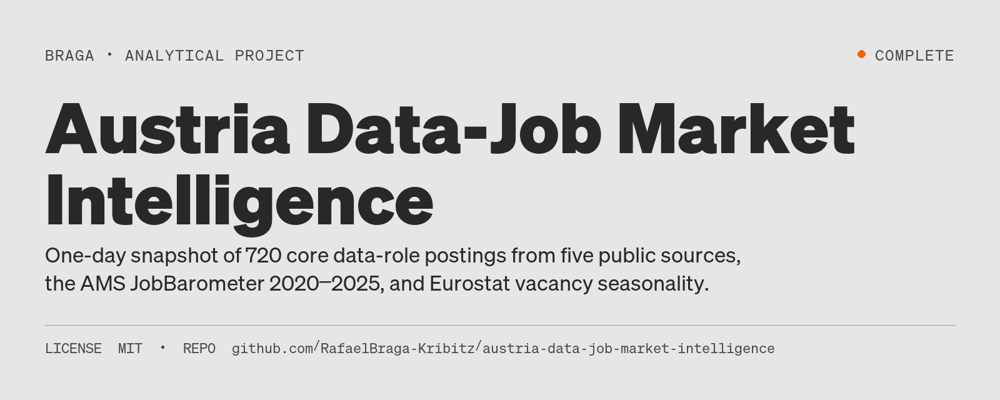
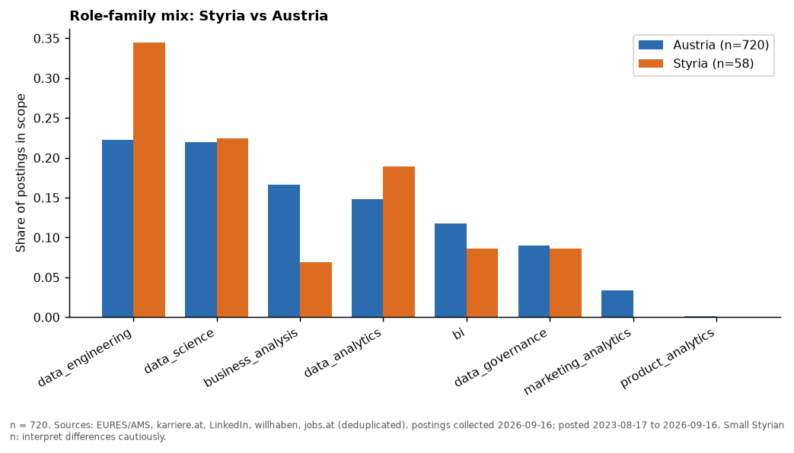
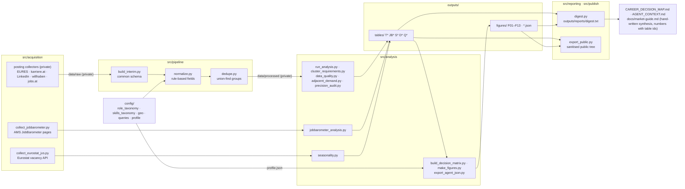

# Austria Data-Job Market Intelligence



[](LICENSE)
[](#status)

**Status:** Complete

An evidence base for data-career decisions in Austria, with a Styria/Graz focus: a one-day snapshot (2026-09-16) of open data-role advertisements from five public sources, the AMS JobBarometer yearly series 2020–2025, transparent rule-based normalisation, aggregated statistics with confidence intervals, and two decision documents (`CAREER_DECISION_MAP.md`, `AGENT_CONTEXT.md`). It is a labour-market intelligence and decision-support project, not a portfolio dashboard.



## Key findings

Evidence in `docs/market-guide.md`; all shares = share of ads that mention an item. In one paragraph: open core data postings are concentrated in Vienna, data engineering and data science are the largest families, the advertised stack is Microsoft-centred, 40 % of ads state a German requirement, advertised salaries are mostly collective-agreement floors, and Styria is small in the snapshot but the only large region above its 2020 level on the official yearly series. Each bullet below is traced to a table id in `docs/market-guide.md`; Styrian figures are tentative (n = 58) and quoted as counts.

* Vienna holds 48 % of open core postings; Styria 7.5 % of the snapshot but 13.6 % of the official yearly flow, and the only large region above its 2020 level (AMS "Data Scientist" class: Austria −28 % vs 2020, Styria +34 %).
* Data engineering and data science are the largest families (22 % each); "Data Engineer" is the largest title (134); marketing- and product-analytics titles are rare (25 of 720, none in Styria).
* SQL (40 %) and Python (35 %) lead; the stack is Microsoft-centred (Azure 19 %, Power BI 18 %; Tableau 3 %); SQL and Python co-occur in 24 % of ads; Python libraries and statistical methods are rarely named; specific certifications ≤ 3 % each; PhD 2 %.
* 40 % of ads state a German requirement, mostly with "sehr gut"/C1-equivalent wording; 24 % are written in English (data science 44 %), but 19 % of those still state a German requirement. In Styria 8 of 58 ads are English-written without a stated German requirement.
* Advertised salary figures are collective-agreement minimums in 81 % of cases (medians by family €42k–€55k; senior ≈ €60k floors); actual pay cannot be estimated from ads. Hybrid is the norm in ads that say anything; fully remote 2 %.
* Seasonality (Eurostat vacancy series, 17 years, quarterly): Q4 is the weakest quarter in every sector aggregate and Q1 the most frequent peak, but the amplitude is only 5–14 % against 255–567 % between years — the cycle dominates the calendar. The project's own one-day snapshot cannot measure seasonality, and `docs/seasonality.md` shows why.

## Explore this project

| Audience | Start here |
|---|---|
| Recruiter | [Key findings](#key-findings) above, then the decision document [CAREER_DECISION_MAP.md](CAREER_DECISION_MAP.md) |
| Hiring manager | [Method](#method) and [Limitations](#limitations-docslimitationsmd), then the findings table by table in [docs/market-guide.md](docs/market-guide.md) |
| Technical reviewer | [Architecture](#architecture), the rule engine [src/pipeline/normalize.py](src/pipeline/normalize.py), the tests [tests/test_pipeline.py](tests/test_pipeline.py) and [Reproduction](#reproduction) |
| Auditor | [Data](#data) with its epistemic tags, [docs/data-quality.md](docs/data-quality.md), [docs/legal-and-publication-audit.md](docs/legal-and-publication-audit.md) and [PUBLICATION_DECISION.md](PUBLICATION_DECISION.md) |

## Why this project

The decision documents are written for one specific profile (senior marketing/growth professional moving into data roles; English-fluent; German A2–B1; Graz-based; `config/profile.json`) and for the AI agents that help that person. `CAREER_DECISION_MAP.md` states its purpose as the one document to open before a major career decision, with every statement traced to a table. The standard the project tries to meet: a technically competent, professionally sceptical reader should be able to audit the methodology, the provenance, the limitations and the conclusions.

## What is in this repository (public) and what is not

| Public (this repository) | Private (retained by the author, not redistributed) |
|---|---|
| Pipeline, analysis, reporting and publication code (`src/pipeline`, `src/analysis`, `src/reporting`, `src/publish`), the AMS JobBarometer and Eurostat collectors, **and the Eurostat raw data** (openly licensed, so the seasonality layer is fully reproducible) | The six posting collectors (EURES, karriere.at, LinkedIn, willhaben, jobs.at, EURES regional sweep) |
| Rule configurations (`config/`): role taxonomy, skill vocabulary, geography, queries, profile | Raw source records (`data/raw`, 1.3 GB), processed posting files (`data/processed`), fetched third-party reference pages (`data/external`), run logs |
| Methodology, source inventory, data-quality, limitations, legal/publication audit, specification audit, decision framework (`docs/`) | Per-posting tables that carry advertisement text, contact data or source URLs |
| Aggregated tables (`outputs/tables`, 140+ CSVs, with every text/URL column removed), figures, JSON summaries, the digest of every quoted number | The git history of the private repository |
| Decision documents, decision log, tests (rule tests run anywhere; integrity tests skip without the private data) | |

Why the split, in one paragraph: the advertisements are third-party text, the sources hold database rights and restrict automated extraction in their terms, and the ads contain contact persons' names, e-mails and phone numbers. Aggregated statistics contain none of that. The full reasoning, with the clauses and statutes fetched on 2026-09-16, is in `docs/legal-and-publication-audit.md`; the decision is in `PUBLICATION_DECISION.md`. This is a publication-readiness analysis, not legal advice.

## Research questions

What does the Austrian data-job market contain — which titles, where, with which technologies, languages, education, advertised pay and work model — how does Styria/Graz differ from Vienna, and what does that imply for what to learn, build, demonstrate, target or deprioritise? The answers, each traced to a table, are in `CAREER_DECISION_MAP.md`; the evidence is in `docs/market-guide.md`.

## Sources and collection period

Postings collected on **2026-09-16** (17:00–18:40 UTC), Austria-wide, 45 title keywords in English and German, no login, no CAPTCHA or paywall bypass, polite throttling: EURES portal (mirror of the AMS "PES Austria" feed), karriere.at, LinkedIn logged-out job pages, willhaben Jobs, jobs.at. Official series: AMS JobBarometer (online ads per occupation class × Bundesland, 2020–2025). Taxonomy: ESCO. Blocked and excluded: StepStone.at, Indeed.at, hokify, Glassdoor, the AMS API. Inventory and terms-of-use findings: `docs/data-sources.md`. **The audit found that all five posting sources restrict automated extraction in their terms; the dataset is therefore a one-off private research collection and this repository does not claim it can be refreshed the same way** (`DECISION_LOG.md` D-013).

## Data

What each published artifact rests on. Table ids refer to `outputs/tables/`; JSON files to `outputs/`. No artifact is SIMULATED: nothing in the repository is a synthetic or generated series, and every quoted number is copied from a table.

| Artifact | Tag | Basis |
|---|---|---|
| Raw and unique posting counts, per-source coverage and overlap (12,429 raw rows → 10,945 unique; T01, T01b, Q04) | VERIFIED | Records collected 2026-09-16; duplicate groups formed by the documented keys in `dedupe.py` (in-scope duplicate rate 24 %) |
| AMS JobBarometer yearly series 2020–2025 (JB01–JB05, `jobbarometer.json`; 590 pages) | VERIFIED | Official counts copied from the AMS pages; "<20" censored; an occupation class, not this project's titles |
| Eurostat job-vacancy series and seasonal indices (S01–S06, `seasonality.json`; raw response in `data/raw/eurostat_jvs/`) | VERIFIED | Open API, aggregation only, re-runnable end to end from this repository |
| Role families, core/adjacent sets and geography flags (720 core, 546 adjacent, 58 Styria; T02, T03, `roles.json`, `locations.json`) | CALIBRATED | Ordered regex rules in `config/role_taxonomy.json` and `config/geo.json`; title precision 83 % strict / 95 % lenient on a 177-title hand-labelled sample; recall unmeasured |
| Skill, language, education, experience and work-model shares (T05–T08, T10–T11, T14, `skills.json`, `languages.json`) | CALIBRATED | Bilingual regex vocabulary (~250 canonical skills, 13 categories) and ±120-character context windows; spot-checks only, no measured precision/recall |
| Advertised salary floors (T09, `salaries.json`) | CALIBRATED | Parsed figures, monthly ×14 → annual gross; 81 % are collective-agreement minimums; floors on ads, not pay |
| Requirement clusters (T15, `clusters.json`) | CALIBRATED | k-means / NMF on the binary skill matrix; silhouette 0.07; reading aids, not occupational categories |
| Decision matrix and learning priorities (D01–D04, `career_paths.json`) | CALIBRATED | Transparent weighted scoring of the tables against the self-declared profile (`config/profile.json`), with a sensitivity check under alternative weights |
| Figures F01–F13 | as the table each one plots | Title, n, source and period printed on each chart |

| Tag | Meaning |
|---|---|
| `VERIFIED` | Directly supported by external or source data; no modelling assumptions beyond unit conversion and aggregation |
| `CALIBRATED` | Derived through documented assumptions anchored to real data |
| `SIMULATED` | Output of a seeded stochastic or generative procedure |
| `ILLUSTRATIVE` | Example only; not evidence |

## Method

Every step is a script in `src/`; every rule lives in `config/`; every intermediate file is kept in `data/` (full description in `docs/methodology.md`).

1. **Input.** The collectors (`src/acquisition/collect_*.py`) write `data/raw/<source>/<date>/*.jsonl`; every record keeps a collection envelope (`source`, `collected_at`, `query`). About 45 title keywords in English and German (`config/queries.json`) run Austria-wide on each source; the keyword set is deliberately broad, and inclusion is decided by title normalisation, not by the query (`DECISION_LOG.md` D-002). The JobBarometer collector reads the server-rendered AMS pages; the Eurostat collector reads the open API.
2. **Interim schema** (`src/pipeline/build_interim.py`). One row per source posting mapped to a common field set (title, company, location text, NUTS codes, dates, full description, employment type, raw salary, remote flag, the queries that surfaced it). Duplicates of the same `source_id` across queries are collapsed; nothing else is dropped.
3. **Normalisation** (`src/pipeline/normalize.py`, rules in `config/*.json`). Title cleaning (gender markers, hours, location noise); the first matching ordered regex rule assigns `normalized_title` and `role_family` (`role_taxonomy.json`); seniority from title words; geography from explicit fields → NUTS-3 → postcode/city in the text (`geo.json`); work model from phrase classes; salary from structured fields or figures near salary words, monthly ×14 → annual gross, with flags for collective-agreement wording; German/English requirements from ±120-character windows around language mentions; posting language from the German/English stop-word ratio; experience years, degree requirement and skills from a bilingual vocabulary (`skills_taxonomy.json`). Every heuristic field carries an evidence or confidence field.
4. **Deduplication** (`src/pipeline/dedupe.py`). Union-find over (company, title, state), (title, description fingerprint) and (company, title) when the state is missing; the canonical row is the longest description, ties broken by source priority; all rows are kept with a group id and `is_canonical`.
5. **Aggregation** (`src/analysis/`). Core set = canonical rows in eight data families; the adjacent set is reported separately; text-derived shares use postings with a description longer than 300 characters as denominator; every table stores `n`; Wilson 95 % confidence intervals on proportions that feed decisions; k-means/NMF requirement clusters as descriptive archetypes only; JobBarometer and Eurostat series are analysed as their own units and never merged with posting-level statistics.
6. **Validation.** `tests/test_pipeline.py` checks rule behaviour on known inputs and the internal consistency of the processed outputs; the 177-title manual precision audit (Q03c) measures the taxonomy; `src/reporting/digest.py` reprints every number quoted in the documents from `outputs/`.
7. **Decision documents.** `docs/market-guide.md` reports the findings table by table; `CAREER_DECISION_MAP.md` and `docs/career-map.md` score each path on transparent variables (postings, Styria postings, English-posting share, German-required share, skill overlap with the profile, median advertised minimum salary, remote share) with stated normalisation and weights plus a sensitivity check with alternative weights (`docs/decision-framework.md`, `src/analysis/build_decision_matrix.py`). No hidden scoring.

## Coverage and quality (docs/data-quality.md)

12,429 raw rows → 10,945 unique postings → **720 core data-role postings** (719 with description; 58 in Styria, 52 in the Graz area, 350 in Vienna incl. multi-site ads), plus 546 adjacent titles reported separately; 387 named employers nationally (140 core postings carry no employer name); in-scope duplicate rate 24 %; title-classification precision 83 % strict / 95 % lenient on a 177-title hand-labelled sample; 590 JobBarometer pages; a 12,000-posting full-text sweep of the AMS feed for Styria/Vienna/Upper Austria to measure adjacent demand.

## Architecture



## Repository map

```text
CAREER_DECISION_MAP.md      decision document (read first) — ends with "What would change this map?"
AGENT_CONTEXT.md            canonical compact context for AI agents (numbers, definitions, confidence, publication status)
DECISION_LOG.md             why each analytical and publication decision was made (D-001 … D-014)
PUBLICATION_DECISION.md     publication-readiness conclusion and public/private boundary
docs/                       methodology · data-sources · research-landscape · role-taxonomy · posting-bias · salary-context
                            market-guide (findings) · data-quality · limitations · career-map · decision-framework
                            seasonality · legal-and-publication-audit · original-specification-audit
config/                     queries.json · role_taxonomy.json · skills_taxonomy.json · geo.json · profile.json
src/acquisition/            common.py · collect_jobbarometer.py · collect_eurostat_jvs.py   (posting collectors: private)
src/pipeline/               build_interim.py → normalize.py → dedupe.py · patch_configs_2026-09-16_audit.py
src/analysis/               run_analysis.py · cluster_requirements.py · jobbarometer_analysis.py · adjacent_demand.py
                            data_quality.py · build_decision_matrix.py · make_figures.py · export_agent_json.py · precision_audit.py · seasonality.py
src/reporting/digest.py     prints every figure quoted in the documents (outputs/reports/digest.txt)
src/publish/export_public.py builds the sanitised public tree and refuses to export personal data or free text
outputs/tables/             T* posting tables · JB* JobBarometer · S* seasonality · D* decision matrix · Q* quality (incl. Q03c precision audit)
outputs/figures/            F01–F13 charts (title, n, source, period on each)
outputs/*.json              market_summary · skills · roles · locations · languages · salaries · career_paths · jobbarometer · adjacent_demand · clusters · data_quality · seasonality
schemas/postings_schema.md  field dictionary of the (private) processed posting file
tests/test_pipeline.py      67 tests: rule behaviour on known inputs + integrity of processed outputs (skipped when data is absent)
data/raw/eurostat_jvs/      Eurostat vacancy series (public; the rest of data/ is private, see PUBLICATION_DECISION.md)
```

## Reproduction

Environment: Python 3.12 (any OS); `pip install -r requirements.txt`.

What an outside reader can reproduce from this repository: every rule (run the unit tests), every aggregation step (read `src/analysis`), the consistency of the quoted numbers with the tables (`python src/reporting/digest.py` prints the digest from `outputs/`; `python -m pytest tests -q` checks table internal consistency), the JobBarometer series (`python src/acquisition/collect_jobbarometer.py` then `python src/analysis/jobbarometer_analysis.py`), and **the entire seasonality analysis end to end** (`python src/acquisition/collect_eurostat_jvs.py` then `python src/analysis/seasonality.py`), because the Eurostat API is open and its raw response is in the repository.

What requires the private data: steps 2–4 below, which are deterministic given `data/raw`.

```bash
# 1. acquisition (posting collectors are private; see DECISION_LOG D-013 before re-running any of them)
python src/acquisition/collect_jobbarometer.py    # public body statistics, permitted
python src/acquisition/collect_eurostat_jvs.py    # open Eurostat API, permitted, runnable by anyone
# 2. pipeline (deterministic given data/raw; ~5 min)
python src/pipeline/build_interim.py && python src/pipeline/normalize.py && python src/pipeline/dedupe.py
# 3. analysis
python src/analysis/run_analysis.py && python src/analysis/cluster_requirements.py && python src/analysis/data_quality.py
python src/analysis/jobbarometer_analysis.py && python src/analysis/adjacent_demand.py && python src/analysis/build_decision_matrix.py
python src/analysis/make_figures.py && python src/analysis/export_agent_json.py && python src/analysis/seasonality.py
python src/reporting/digest.py > outputs/reports/digest.txt
# 4. validation and publication
python -m pytest tests -q
python src/publish/export_public.py ../austria-data-job-market-intelligence-public
```

After a re-run, update the numbers in `docs/market-guide.md`, `CAREER_DECISION_MAP.md` and `AGENT_CONTEXT.md` from `outputs/reports/digest.txt`, and record rule changes in `DECISION_LOG.md`.

## Stack

Versions as pinned in `requirements.txt` for the 2026-09-16 run (tested with Python 3.12.10 on Windows 11).

| Technology | Role in this project |
|---|---|
| Python 3.12 | Every step from acquisition to publication is a plain script |
| pandas 2.3.3, numpy 2.5.1 | Interim/normalised/deduplicated posting tables and all aggregations |
| pyarrow ≥ 17 | Parquet copies of the intermediate posting files written by the pipeline |
| scikit-learn 1.9.0 (scipy ≥ 1.14) | k-means, NMF and silhouette score for the requirement clusters |
| matplotlib ≥ 3.9 | Figures F01–F13 |
| requests ≥ 2.32, lxml ≥ 5, beautifulsoup4 ≥ 4.12 | Collectors and HTML parsing (posting collectors are private) |
| pytest ≥ 8 | Rule tests and output-integrity tests in `tests/test_pipeline.py` |

## Limitations (docs/limitations.md)

* One-day stock, not yearly flow, not vacancies, not hires.
* StepStone/Indeed and company career pages missing.
* Title-based inclusion with measured precision but unmeasured recall.
* Rule-based extraction with spot-checks.
* 19 % of core postings without employer name.
* Salary = legal floors.
* "C1-equivalent" is mostly "sehr gut" wording.
* Styrian cells small (n = 58, reported as counts).
* No hiring outcomes and no causal claims.

What would change this map: `CAREER_DECISION_MAP.md` ends with a table of the observations that would change its conclusions, among them a larger Styrian sample moving any Styrian family count above 30 (which would remove the "tentative" label on Styrian statements), StepStone.at/Indeed data with a different family, language or salary mix, the English-written share in Styria rising above ~25 % or C1 wording falling (which would change the "German is the largest stated barrier" conclusion), JobBarometer 2026 reversing Styria's relative resilience, and actual interview/hiring outcomes for this profile — the only observation that can turn requirement patterns into evidence about hiring. Reconsider the map if any of these observations arrives.

## How future agents should use it

1. Read `AGENT_CONTEXT.md` (numbers, definitions, confidence, publication status) and `CAREER_DECISION_MAP.md` (decisions).
2. For any specific question, open the named table in `outputs/tables/` or the JSON in `outputs/`.
3. Check the data vintage; if older than ~3 months, ask the owner before any new collection (D-013).
4. Do not quote Styria-only percentages without the n; do not mix advertised salary floors with survey medians; do not read "share" as "required"; do not read the snapshot as yearly demand; do not present language requirements as causal evidence about hiring.

## Maintenance

The highest-value additions, in order: StepStone.at coverage through a permitted channel; Styrian employer career pages where terms allow; a 100-posting manual extraction audit for skills/language/salary (the title audit exists, Q03c); recording actual application outcomes; a permitted longitudinal refresh (JobBarometer yearly, AMS open data).

## Status

**Status:** Complete

Repository last updated 2026-09-17 (last commit on `main`).

## Licence and citation

Code: MIT. Documents and aggregated outputs: CC BY 4.0. No licence is granted for third-party content (see `LICENSE`). Cite as in `CITATION.cff`.

## Author

<table>
  <tr>
    <td width="110">
      
    </td>
    <td>
      <strong>Rafael Braga-Kribitz</strong><br />
      Seiersberg-Pirka, Austria · Portfolio project, 2026<br />
      <a href="https://www.linkedin.com/in/rafaelbragakribitz/">LinkedIn</a>
      ·
      <a href="mailto:rafaelbragakribitz@gmail.com">rafaelbragakribitz@gmail.com</a>
    </td>
  </tr>
</table>
