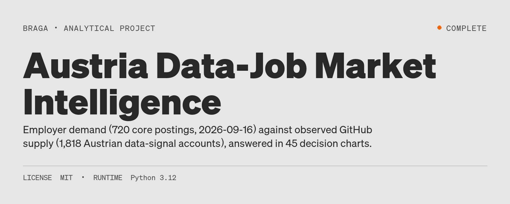
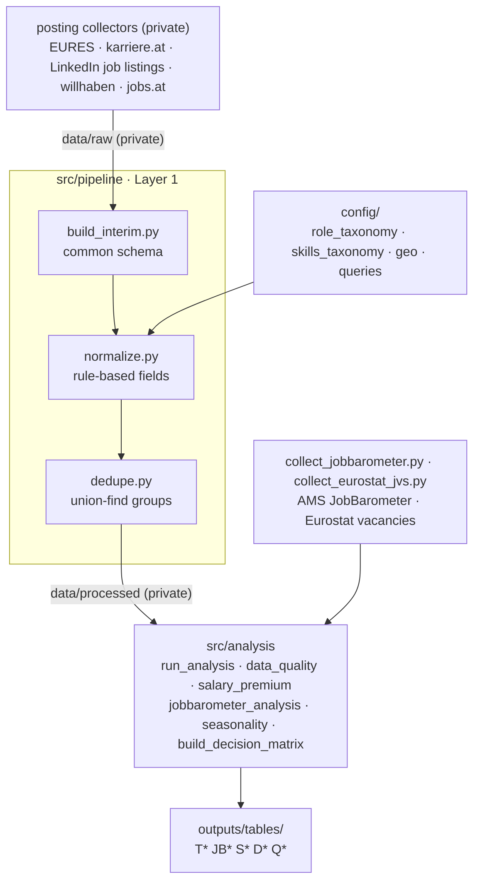
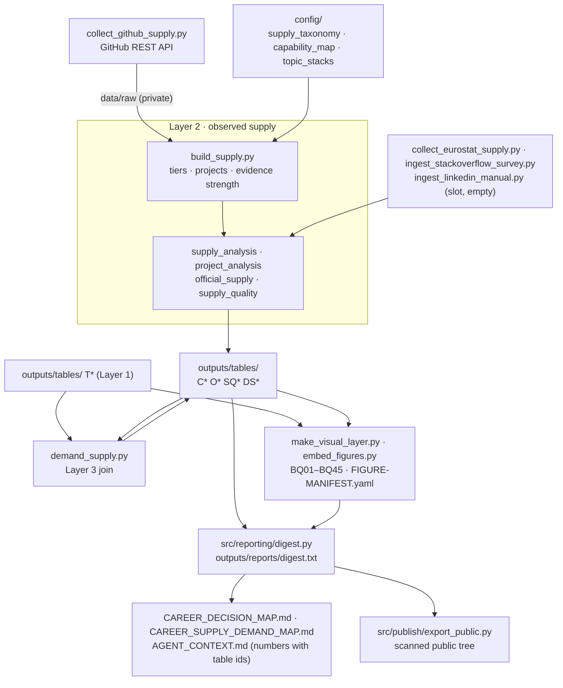

# Austria Data-Job Market Intelligence



[](https://github.com/RafaelBraga-Kribitz/austria-data-job-market-intelligence/actions/workflows/tests.yml)
[](https://github.com/RafaelBraga-Kribitz/austria-data-job-market-intelligence/actions/workflows/readme-quality.yml)
[](LICENSE)
[](LICENSE)
[](requirements.txt)
[](#status)

**Status:** Complete

Which data roles do Austrian employers advertise, who publicly competes for them, and which demanded capabilities are rarely demonstrated? This repository answers that for data-career decisions in Austria, with a Styria/Graz focus, in three evidence layers — employer demand (open data-role ads on 2026-09-16, the AMS JobBarometer, Eurostat), observed candidate supply (public GitHub accounts located in Austria, 2026-09-17) and demand × supply — plus a visual layer of 45 decision questions, each answered by one chart.


*SQL is named in 41 % of ads and shown in a project by 10 % of observed candidates, the largest gap a public portfolio can close (DS10, CALIBRATED). Power BI, Excel and SAP are demanded as often but invisible on GitHub.*

## Key findings

Every number below is copied from a table in `outputs/tables/` (id in brackets) and reprinted by [`src/reporting/digest.py`](src/reporting/digest.py) into [`outputs/reports/digest.txt`](outputs/reports/digest.txt). "Share" means share of ads or accounts that *mention* an item, not that require it. Styria and Vienna are counted on two bases: **by primary state 54 / 343** of 720 core postings (T03a), or **any listed site 58 / 350** (T02, `market_summary.json`); regional shares use the first, the Styrian family and language cells the second. Styrian candidates: **56 bio-declared and 248 data-signal accounts, location-resolved** (C05a); the frame-B complete-Styria subset gives 52 / 247 (C05c). Every Styrian cell is small and quoted as a count.

### Layer 1 · employer demand: 720 core postings, 48 % of them in Vienna

* Vienna holds 343 of 720 open core postings (48 %), Styria 54 (7.5 %) by primary state [T03a]. On the official yearly series Styria is 13.6 % of the national flow and +34 % against 2020 (224 → 300 ads) while Austria is −28 % [JB05].
* Data engineering (160) and data science (158) are the largest families, 22 % each; "Data Engineer" is the largest title (134); marketing and product analytics are 25 of 720 and absent from Styria [T02, T02b].
* SQL is named in 40.5 % of the 719 ads with a description (95 % CI 36.9–44.1 %), Python in 35 %; the stack is Microsoft-centred: Azure 19 % vs AWS 9 %, Power BI 18 % vs Tableau 3 % [T05].
* 40 % of ads state a German requirement and 24 % are written in English (data science 44 %, BI 8 %); 19 % of the English-written ads still state one. In Styria 8 of 58 are English-written without a stated German requirement [T07, T07c, T07e].
* 569 of 720 ads state a salary figure and 460 of those are a single collective-agreement minimum: floors, not pay. Median advertised minimum €47.8k in data analytics vs €55.4k in data engineering and data science [T09, T09b]. Fully remote: 2 % (14 ads) [T10].
* Seasonality (Eurostat vacancies, 2009–2025): Q4 is the weakest quarter in every sector aggregate, but the seasonal amplitude of 5–14 % is small against 255–567 % between years [S01, S06].


*Staying in Graz means competing for 54 of 720 open postings by primary state; 58 ads list a Styrian site, 52 of them inside the Graz commuting area (T03a, T03c).*


*Styria is the only large region above its 2020 level on the official series (JB01, VERIFIED); an AMS occupation class, coarser than this project's titles.*

### Layer 2 · observed candidate supply: 1,818 Austrian GitHub accounts with a data signal

* 9,409 accounts with an Austrian location → 1,818 with a data signal → 872 with a bio-declared data role [C01]. A public-profile sample, not a census of the workforce.
* Bio-declared roles are 73 % data science (638 of 872, 95 % CI 70–76 %) against 7 % data engineering, 2 % BI and 2 % business analysis [C04].
* Python appears for 74 % of data-signal accounts (45 % in a project), SQL for 16 % (9 % in a project), Azure 5 %, Power BI 3 % [C10].
* 76 % have a documented project, the median is 2 projects; data repositories are 28 % inactive archives, 23 % ML projects and 21 % course or tutorial work [C14, C14b, C14c].
* Of 3,959 documented READMEs, 66 % say how to run the code but 25 % state a result, 12 % limitations and 11 % a business question [C19].
* 99 % of classified bios are written in English; language proficiency is not observable on GitHub [C07].


*A result, a limitation and a business question are the rarest README sections in the Austrian pool (C19).*

### Layer 3 · demand × supply: data science is 3.3× its demand share

* Relative representation (supply share ÷ demand share): data science 3.3× (4.0 declared candidates per posting; Styria 2.9), analytics 1.0×, engineering 0.30×, BI 0.15×, business analysis 0.14×, governance 0.09× [DS01].
* Demanded often, demonstrated rarely (share of ads vs share of candidates with project evidence): SQL 41 % vs 10 %, data quality 31 % vs 5 %, warehouse/modelling 25 % vs 2 %, Azure 19 % vs 3 %, Power BI 18.5 % vs 2 % [DS10].
* Abundant relative to demand: exploratory analysis 10 % of ads vs 38 % of candidates with a project, deep learning/NLP/CV 6 % vs 32.5 %, Java/Scala/C# 13 % vs 50 % [DS10].
* Styria: 54 ads by primary state against 56 bio-declared accounts (1.04 per posting) [DS05]; over the 58 ads listing a Styrian site 0.97 [DS13]. Vienna: 343 ads against at least 478 declared accounts (a lower bound) [DS13].
* Two universes joined on shared taxonomies: read rankings and orders of magnitude, not exact ratios. No composite score is computed; the supply side's language levels are unmeasured (open question OQ-02).


*The label decides the queue: 4.0 declared data scientists per data-science posting against 0.36 engineers per engineering posting (DS01).*

### Layer V · 45 questions, one chart each

[`docs/visual-decision-board.md`](docs/visual-decision-board.md) restates every decision-bearing finding as a question and answers it with one chart (`outputs/figures/BQ01–BQ45`, PNG plus SHA-256-sealed SVG). [`outputs/visual_questions.json`](outputs/visual_questions.json) maps each question to its answer, source tables and caveat; [`docs/question-coverage-audit.md`](docs/question-coverage-audit.md) and [`docs/open-questions.md`](docs/open-questions.md) register what the data cannot answer (24 entries). One reading was corrected by D-025: raw skill "premiums" in advertised floors are mostly composition.


*After controls, 14 of 16 skill premiums straddle zero; Python's raw +8 % becomes −7 % (D05, OLS with HC1 errors, association not causation).*

## Explore this project

| Audience | Start here |
|---|---|
| Recruiter | [Key findings](#key-findings), then [docs/visual-decision-board.md](docs/visual-decision-board.md) (45 questions, one chart each) |
| Hiring manager | [CAREER_DECISION_MAP.md](CAREER_DECISION_MAP.md) (demand) and [CAREER_SUPPLY_DEMAND_MAP.md](CAREER_SUPPLY_DEMAND_MAP.md) (demand × supply), then [Method](#method) and [Limitations](#limitations) |
| Technical reviewer | [Architecture](#architecture), [run_all.py](run_all.py), the rule engine [src/pipeline/normalize.py](src/pipeline/normalize.py), the [tests](tests/) and [Reproduction](#reproduction) |
| Auditor | [Data](#data) with its epistemic tags, [docs/data-quality.md](docs/data-quality.md), [docs/supply-data-quality.md](docs/supply-data-quality.md), [docs/legal-and-publication-audit.md](docs/legal-and-publication-audit.md), [PUBLICATION_DECISION.md](PUBLICATION_DECISION.md) and the export guard [src/publish/export_public.py](src/publish/export_public.py) |
| AI agent | [AGENT_CONTEXT.md](AGENT_CONTEXT.md), then [outputs/visual_questions.json](outputs/visual_questions.json) and [outputs/operational_career_context.json](outputs/operational_career_context.json) |

## Why this project

The decision documents were written for one specific profile (a senior marketing and growth professional moving into data roles, English-fluent, German A2–B1, based near Graz) and for the AI agents that help that person. The profile itself stays private; the public tree ships a neutral example as `config/profile.json`, so the profile-dependent outputs (D01–D04, BQ08, BQ17) reproduce with different overlap values. The standard the project tries to meet: a technically competent, professionally sceptical reader can audit the methodology, the provenance, the limitations and the conclusions.

## What is in this repository (public) and what is not

| Public (this repository) | Private (retained by the author, not redistributed) |
|---|---|
| Pipeline, analysis, visual-layer, reporting and publication code for all layers; the AMS JobBarometer, Eurostat (vacancies, graduates, occupations), GitHub API, Stack Overflow ingestion, manual-LinkedIn-slot ingestion and Arbeitnow API collectors; the Eurostat raw data (openly licensed) | The six Layer 1 posting collectors (EURES incl. its regional text sweep, karriere.at, LinkedIn, willhaben, jobs.at) and the git-ignored hunter under `src/private/` |
| Rule configurations (`config/`): role taxonomy, skill vocabulary, geography, queries, supply taxonomy, capability map, and a neutral example profile | The owner's profile configuration, `library_strategy/`, `docs/linkedin-slot-interface.md`, the profile-specific analysis document and the assumptions review |
| Methodology, source inventory, data-quality, limitations, legal and publication audits, research and completeness audits, labelling protocol (`docs/`) | Raw source records and processed postings (`data/raw` except Eurostat, `data/processed`, `data/external`), run logs, `data/labels`, `data/private` |
| Aggregated tables (`outputs/tables`: T*/JB*/S*/D*/Q* for Layer 1, C*/O*/SQ* for Layer 2, DS* for Layer 3) with every text and URL column removed, figures, JSON summaries, the digest | Layer 2 individual records: GitHub profiles, repositories, READMEs, links, candidate and project tables, review samples, the Stack Overflow extract, any LinkedIn slot records |
| The visual layer: `src/viz/` (house style, vendored Lato under SIL OFL 1.1), the BQ builders, `outputs/figures/BQ*`, `FIGURE-MANIFEST.yaml`, `outputs/visual_questions.json` | Per-posting and per-account tables of any kind; the private repository's git history |

Why the split: the advertisements are third-party text with contact persons, and the job boards hold database rights and restrict automated extraction in their terms; the GitHub profiles carry personal information and the READMEs are third-party text. Aggregated statistics contain none of that. The reasoning, with the clauses fetched on 2026-09-16/17, is in [docs/legal-and-publication-audit.md](docs/legal-and-publication-audit.md) (§10 for Layer 2) and the decisions in [PUBLICATION_DECISION.md](PUBLICATION_DECISION.md). This is a publication-readiness analysis, not legal advice.

## Research questions

**Layer 1.** What does the Austrian data-job market contain (titles, locations, technologies, languages, education, advertised pay, work model), and how does Styria/Graz differ from Vienna? ([docs/market-guide.md](docs/market-guide.md))

**Layer 2.** Who is publicly observable as a candidate for those roles: what do they call themselves, where are they, how senior, what do they build, and how do they document it? ([docs/supply-findings.md](docs/supply-findings.md))

**Layer 3.** Where do supply and demand converge or diverge, which demanded capabilities are rarely demonstrated in public evidence, and what should a project demonstrate? ([CAREER_SUPPLY_DEMAND_MAP.md](CAREER_SUPPLY_DEMAND_MAP.md), [docs/project-evidence-map.md](docs/project-evidence-map.md))

**Layer V.** Which business question does each finding answer, and which chart shows it? ([docs/visual-decision-board.md](docs/visual-decision-board.md))

## Data

### Sources and collection

* **Layer 1 (2026-09-16, 17:00–18:40 UTC).** EURES/AMS, karriere.at, LinkedIn job listings (logged-out job pages), willhaben and jobs.at, Austria-wide, 45 title keywords in English and German, no login and no CAPTCHA or paywall bypass: 12,429 raw rows → 10,945 unique postings → **720 core data-role postings** plus 546 adjacent titles reported separately. AMS JobBarometer 2020–2025 (590 pages); Eurostat job-vacancy series 2009–2025. StepStone.at and Indeed.at returned HTTP 403 and are missing. The five boards restrict automated extraction, so collectors and raw records stay unpublished; private re-collection goes into new dated folders and is never merged with this snapshot (D-013, D-022). Arbeitnow (documented API) is a dated supplement only (T19).
* **Layer 2 (2026-09-17/18).** GitHub REST API (no names or e-mails requested): 1,075 user searches in three frames → 9,457 accounts → 9,409 with an Austrian location → 1,818 with a data signal, 872 bio-declared; 11,798 READMEs and file trees [SQ01, C01]. Stack Overflow Developer Survey 2025 (ODbL; 410 Austrian respondents). Eurostat graduates, employment by occupation and ICT specialists. **LinkedIn member and people data is never collected by automation** (D-018, D-026); a private slot for hand-coded or licensed records exists and is still empty. LinkedIn *job listings* were collected (Layer 1, and the dated T19 supplement under D-022). Kaggle was not collected (D-030).

### What each artifact rests on

| Artifact | Tag | Basis |
|---|---|---|
| Posting counts, source coverage and overlap (T01, T01b, Q04) | `VERIFIED` | Records collected 2026-09-16; duplicate groups from the documented keys in `dedupe.py` (in-scope duplicate rate 24 %) |
| AMS JobBarometer 2020–2025 (JB01–JB05); Eurostat vacancies (S01–S06), graduates and occupations (O tables) | `VERIFIED` | Official counts, aggregation only; Eurostat raw responses are in `data/raw/` |
| GitHub collection counts, frames and tiers (C01, SQ01, SQ09) | `VERIFIED` | API records collected 2026-09-17/18; Styria complete (frame B), Vienna a lower bound |
| Role families, geography, skills, languages, education, work model (T02–T14) | `CALIBRATED` | Ordered regex rules in `config/`; title precision 83 % strict / 95 % lenient on 177 hand-labelled titles (Q03c); recall unmeasured |
| Advertised salary floors (T09) and the controlled skill premium (D05) | `CALIBRATED` | Monthly × 14 → annual gross; D05 = OLS on log minimum with family, seniority and state controls, 95 % intervals, Holm and Benjamini-Hochberg |
| Requirement clusters (T15) and decision matrix (D01–D04) | `CALIBRATED` | k-means / NMF (silhouette 0.075, reading aids only); weighted scoring against the private profile with a sensitivity check |
| Supply families, skills, projects, READMEs (C03–C24) | `CALIBRATED` | Bio → family 78 % strict / 90 % lenient (SQ10); repository → project 75 % / 92.5 % (SQ11) |
| Demand × supply (DS01–DS13) | `CALIBRATED` | Two universes joined on shared taxonomies |
| Figures BQ01–BQ45 | as the table each one plots | Answer computed from the tables at render time; SVG bytes sealed in `FIGURE-MANIFEST.yaml` |

Nothing in the repository is `SIMULATED` or `ILLUSTRATIVE`: there is no synthetic or generated series, and every quoted number is copied from a table.

| Tag | Meaning |
|---|---|
| `VERIFIED` | Directly supported by external or source data; no modelling assumptions beyond unit conversion and aggregation |
| `CALIBRATED` | Derived through documented assumptions anchored to real data |
| `SIMULATED` | Output of a seeded stochastic or generative procedure |
| `ILLUSTRATIVE` | Example only; not evidence |

## Method

Every step is a script run in a fixed order by [`run_all.py`](run_all.py); every rule lives in `config/` (full descriptions: [docs/methodology.md](docs/methodology.md), [docs/supply-methodology.md](docs/supply-methodology.md), [docs/demand-supply-methodology.md](docs/demand-supply-methodology.md)).

1. **Input.** Collectors write dated raw folders with a collection envelope per record. Inclusion is decided by title normalisation, not by the query (D-002).
2. **Layer 1 pipeline.** `build_interim.py` maps each source to a common schema; `normalize.py` assigns family, seniority, geography, work model, salary, language requirements and skills from ordered rules and ±120-character context windows, each with an evidence field; `dedupe.py` forms union-find duplicate groups and keeps a canonical row.
3. **Layer 2 pipeline.** `build_supply.py` classifies accounts into tiers (bio-declared, repository-evidenced, weak, none) and repositories into projects, with an evidence strength per skill (mentioned < used < demonstrated < project-demonstrated).
4. **Aggregation.** Core set = canonical postings in eight data families; text-derived shares use the 719 postings with a description; every table stores `n`; Wilson 95 % confidence intervals on proportions that feed decisions. Official series are analysed as their own units and never merged with posting-level statistics.
5. **Layer 3.** `demand_supply.py` joins both sides on the Layer 1 taxonomies and a capability map; it reports ratios and quadrants, never a composite score or an individual ranking.
6. **Layer V.** `make_visual_layer.py` renders BQ01–BQ45 from the tables and seals each SVG; `embed_figures.py` attaches each chart to the passage it answers.
7. **Decision documents.** `CAREER_DECISION_MAP.md`, `CAREER_SUPPLY_DEMAND_MAP.md` and `AGENT_CONTEXT.md` are hand-written from the digest, with a table id next to every number.

## Validation

* **Hand-labelled audits.** Title classification 83 % strict / 95 % lenient precision on 177 titles (Q03c); bio → family 78 % / 90 % and repository → project 75 % / 92.5 % on 40-item random samples (SQ10, SQ11). Recall is not measured (OQ-09).
* **Tests.** `python -m pytest -q` runs unit tests of the rule modules, value checks of the visual layer's answer sentences against the cited tables, and integrity checks of the processed data; in the public tree the integrity checks that need `data/processed` skip and are listed in a summary banner.
* **Digest.** `src/reporting/digest.py` reprints every quoted number from `outputs/`; its last section reports missing inputs or failed sections.
* **Export guard.** `src/publish/export_public.py` builds this public tree in a staging folder and blocks it on any e-mail address, phone number, job-advertisement link, secret-like token, source posting id, over-long free-text cell, suppression-threshold breach or private path.

## Architecture

The repository has two evidence streams that meet in `outputs/tables/`. The first is employer demand: private posting collectors write raw ads, the Layer 1 pipeline puts them into a common schema, applies the rule-based taxonomies and collapses duplicates; the official AMS and Eurostat series are already aggregated at source and land in the same tables.


```mermaid
flowchart TD
  A1["posting collectors (private)<br/>EURES · karriere.at · LinkedIn job listings · willhaben · jobs.at"]
  A2["collect_jobbarometer.py · collect_eurostat_jvs.py<br/>AMS JobBarometer · Eurostat vacancies"]
  C["config/<br/>role_taxonomy · skills_taxonomy · geo · queries"]
  subgraph pipe["src/pipeline · Layer 1"]
    P1["build_interim.py<br/>common schema"] --> P2["normalize.py<br/>rule-based fields"] --> P3["dedupe.py<br/>union-find groups"]
  end
  N1["src/analysis<br/>run_analysis · data_quality · salary_premium<br/>jobbarometer_analysis · seasonality · build_decision_matrix"]
  O1["outputs/tables/<br/>T* JB* S* D* Q*"]
  A1 -->|"data/raw (private)"| P1
  C --> P2
  P3 -->|"data/processed (private)"| N1
  A2 --> N1
  N1 --> O1
```

*Layer 1. Everything upstream of `outputs/tables/` is the 720-ad snapshot and the official series.*

The second stream is observed supply. The GitHub collector and the survey and Eurostat ingesters feed the Layer 2 build; Layer 3 joins its tables with the Layer 1 tables; the visual layer, the digest and the export read only the tables.


```mermaid
flowchart TD
  G["collect_github_supply.py<br/>GitHub REST API"]
  E["collect_eurostat_supply.py · ingest_stackoverflow_survey.py<br/>ingest_linkedin_manual.py (slot, empty)"]
  C2["config/<br/>supply_taxonomy · capability_map · topic_stacks"]
  subgraph l2["Layer 2 · observed supply"]
    B["build_supply.py<br/>tiers · projects · evidence strength"] --> S["supply_analysis · project_analysis<br/>official_supply · supply_quality"]
  end
  O1["outputs/tables/ T* (Layer 1)"]
  J["demand_supply.py<br/>Layer 3 join"]
  O2["outputs/tables/<br/>C* O* SQ* DS*"]
  V["make_visual_layer.py · embed_figures.py<br/>BQ01–BQ45 · FIGURE-MANIFEST.yaml"]
  R1["src/reporting/digest.py<br/>outputs/reports/digest.txt"]
  R2["src/publish/export_public.py<br/>scanned public tree"]
  D["CAREER_DECISION_MAP.md · CAREER_SUPPLY_DEMAND_MAP.md<br/>AGENT_CONTEXT.md (numbers with table ids)"]
  G -->|"data/raw (private)"| B
  C2 --> B
  E --> S
  S --> O2
  O1 --> J
  O2 --> J
  J --> O2
  O1 --> V
  O2 --> V
  O2 --> R1
  V --> R1
  R1 --> D
  R1 --> R2
```

*Both diagrams are drawn by hand from the step order in `run_all.py` (2026-09-30), not generated by gitdiagram.*

## Reproduction

Environment: Python 3.12 (tested with 3.12.10 on Windows 11); `pip install -r requirements.txt` (pinned). A Layer 2 re-collection needs a GitHub token (`GH_TOKEN`/`GITHUB_TOKEN`, or a logged-in `gh`).

```bash
pip install -r requirements.txt
python -m pytest -q                 # unit + value checks; integrity checks skip without the private data
python src/reporting/digest.py      # reprint every quoted number from outputs/
python run_all.py --list            # targets, steps, inputs, one-off tools
python run_all.py all --dry-run     # preflight + the exact commands, nothing is run
python run_all.py all               # layer1 -> layer2 -> layer3 -> visual -> digest -> tests
python run_all.py layer2            # any single target: layer1 layer2 layer3 visual digest tests
python run_all.py collect           # PRINTS the collection commands (network; never run from here)
python run_all.py tools             # PRINTS the one-off tools (redaction, precision audit, publication)
```

Reproducible from this repository alone: every rule (tests), every aggregation step (code), the consistency of every quoted number with the tables (digest, tests), the JobBarometer and Eurostat layers end to end, and with a GitHub token the whole Layer 2 collection (~5–7 hours at the API rate limits; [docs/supply-methodology.md](docs/supply-methodology.md) §8). Requires the private data: the Layer 1 build and the Layer 2 build from the stored collection; the preflight of `run_all.py` names the missing folder within a second. Each run writes `outputs/run_manifest.json` (versions, commit, steps, status). Snapshots of different dates are compared table to table, never merged.

**Public export.** `python src/publish/export_public.py <target>` builds this tree in a staging folder next to the target, copies the public-only presentation files (this README, its banner and portrait, the README-gate workflow) over it, scans everything and moves it into the target only when nothing is found. Posting ids become keyed hashes; the key is the private `EXPORT_UID_KEY` environment variable, which never enters the repository.

**CI.** [`tests.yml`](.github/workflows/tests.yml) runs `python -m pytest -q` on Ubuntu and Windows with the pinned requirements. [`readme-quality.yml`](.github/workflows/readme-quality.yml) audits this README against the author's portfolio README contract and fails only on a required item.

## Limitations

* **Demand is a one-day stock** of open ads (2026-09-16), not yearly flow, vacancies or hires; StepStone/Indeed and company career pages are missing ([docs/limitations.md](docs/limitations.md)).
* **Extraction is rule-based:** title precision is measured, recall is not; skills, languages and salary rest on spot-checks. Salary figures are legal floors.
* **Supply is a public-profile sample:** GitHub over-represents engineers, researchers and students and cannot see BI, Excel or SAP work, private repositories, proficiency or hiring; Vienna is a lower bound ([docs/supply-research-audit.md](docs/supply-research-audit.md)).
* **Layer 3 joins two universes** on shared taxonomies: rankings and orders of magnitude, not exact ratios.
* **Styrian cells are small:** the largest Styrian family cell is 20 postings against the project's robustness threshold of 30, so Styrian statements are counts and directions.
* No causal claims about any skill, language or salary.

**Reconsider the conclusions if** a larger Styrian sample moves a family count above 30, StepStone.at or Indeed data shows a different family, language or salary mix, the English-written share in Styria rises above ~25 %, JobBarometer 2026 reverses Styria's relative resilience, a LinkedIn or survey source measures candidates' German levels (OQ-02), or actual application outcomes arrive, the only observation that turns requirement patterns into evidence about hiring. The full list closes [CAREER_DECISION_MAP.md](CAREER_DECISION_MAP.md).

## How future agents should use it

1. Read [AGENT_CONTEXT.md](AGENT_CONTEXT.md), then `CAREER_DECISION_MAP.md` (demand) and `CAREER_SUPPLY_DEMAND_MAP.md` (demand × supply).
2. For a specific question open the named table or JSON; `outputs/visual_questions.json` maps each decision question to its chart and tables.
3. Check the vintage (demand 2026-09-16, supply 2026-09-17); if it is older than ~3 months, ask the owner before any new collection.
4. Never treat supply shares as workforce shares, a missing public trace as a missing skill, or bio language as proficiency; never rank or score individuals; never run automation against LinkedIn member data. For a question the data cannot answer, quote its entry in [docs/open-questions.md](docs/open-questions.md).

## Maintenance

Highest-value additions, in order: fill the LinkedIn slot for Graz and Vienna by hand or from a licensed export (languages with levels, titles, transitions; D-026); repeat the GitHub collection in 3–6 months for a first time series; raise the Vienna base-rate slices; StepStone.at coverage through a permitted channel; record actual application outcomes (OQ-01).

## Repository map

```text
CAREER_DECISION_MAP.md          Layer 1 decision document
CAREER_SUPPLY_DEMAND_MAP.md     Layer 3 decision document (20 questions + "so what")
AGENT_CONTEXT.md                canonical context for AI agents, all layers
DECISION_LOG.md                 D-001 … D-030
PUBLICATION_DECISION.md         publication-readiness conclusions and the public/private boundary
run_all.py                      single entry point: layer1 layer2 layer3 visual digest tests
docs/                           visual-decision-board · question-coverage-audit · open-questions · market-guide
                                methodology · supply-methodology · demand-supply-methodology · data-quality · limitations
                                supply-findings · supply-data-quality · legal-and-publication-audit · labelling-protocol …
config/                         role_taxonomy · skills_taxonomy · geo · queries · supply_taxonomy · capability_map
                                topic_stacks · profile.json (neutral example)
schemas/                        postings_schema.md · supply_schema.md · application_log_schema.md
src/acquisition/                common · collect_jobbarometer · collect_eurostat_jvs · collect_github_supply
                                collect_eurostat_supply · ingest_stackoverflow_survey · ingest_linkedin_manual · collect_arbeitnow
src/pipeline/                   build_interim → normalize → dedupe · build_supply · snapshot_tracking · redaction steps
src/analysis/                   Layer 1, 2 and 3 analysis · make_visual_layer · visual_questions_* · embed_figures
src/viz/                        house style, vendored Lato (SIL OFL 1.1), figure engine
src/reporting/digest.py         prints every quoted figure → outputs/reports/digest.txt
src/publish/export_public.py    builds the scanned public tree
outputs/tables/                 T* JB* S* D* Q* (Layer 1) · C* O* SQ* (Layer 2) · DS* (Layer 3)
outputs/figures/                BQ01–BQ45 (.png + sealed .svg), FIGURE-MANIFEST.yaml; legacy F*, SF*, DSF* PNGs
outputs/*.json                  summaries per layer · visual_questions · run_manifest
data/raw/eurostat_jvs/          public Eurostat raw data (also eurostat_supply/); the rest of data/ is private
tests/                          pytest suite, one file per module family
```

**Legacy figures.** The F/SF/DSF PNGs predate the visual layer, carry no SVG seal and are embedded in no document. Read the BQ figure that answers the same question: F02 → BQ01, F03 → BQ06, F04 → BQ08, F06 → BQ13, F07 → BQ15, F08 → BQ18, F10 → BQ04, F11 → BQ02, F12 → BQ10, F13 → BQ03, F14 → BQ11; SF01 → BQ20, SF02 → BQ39, SF05 → BQ41, SF06 → BQ23, SF07 → BQ40, SF08 → BQ24, SF12 → BQ37, SF13 → BQ26, SF14 → BQ44; DSF01 → BQ20, DSF03 → BQ21, DSF04 → BQ22, DSF05 → BQ37, DSF07 → BQ25, DSF08 → BQ38. No BQ counterpart (read the table): F01 (T02), F05 (T05), F09 (T08), SF09 (C14), SF10 (C15), SF11 (C12), SF15 (O01), SF16 (O04), DSF02 (DS04), DSF06 (DS06).

## Stack

Versions as pinned in `requirements.txt` for the 2026-09-30 re-run (Python 3.12.10, Windows 11).

| Technology | Role in this project |
|---|---|
| Python 3.12 | Every step from acquisition to publication is a plain script run by `run_all.py` |
| pandas 2.3.3, numpy 2.5.1, pyarrow 24.0.0 | Posting and supply tables, all aggregations, Parquet intermediates |
| scikit-learn 1.9.0, scipy 1.18.0 | Requirement clusters (k-means, NMF, silhouette), intervals and the D05 regression |
| matplotlib 3.11.1 + `src/viz` (Lato) | BQ01–BQ45 in one house style, legacy F/SF/DSF figures |
| networkx 3.6.1 | Technology co-occurrence network (SF11) |
| requests 2.34.2, tzdata | Public collectors (AMS JobBarometer pages; Eurostat, GitHub and Arbeitnow APIs) |
| pytest 9.1.1 | Unit, value and integrity tests |

## Status

**Status:** Complete

Release 2026-09-30.1 (`CITATION.cff`): all layers re-run with `python run_all.py all` on 2026-09-30; decisions D-001 to D-030. Data vintages: demand 2026-09-16, supply 2026-09-17.

## Licence and citation

Code (`src/`, `tests/`, `config/`): MIT License. Documents and aggregated outputs (tables, JSON summaries, figures, digest): CC BY 4.0. Eurostat raw data: Commission reuse policy, attribution required. Tables derived from the Stack Overflow survey: produced works of ODbL data. Vendored Lato fonts: SIL OFL 1.1. No licence is granted for third-party content; the exact split is in [LICENSE](LICENSE). Cite as in [CITATION.cff](CITATION.cff) (version 2026-09-30.1); there is no DOI.

## Author

<table>
  <tr>
    <td width="110">
      
    </td>
    <td>
      <strong>Rafael Braga-Kribitz</strong><br />
      Seiersberg-Pirka, Austria · Portfolio project, 2026<br />
      <a href="https://www.linkedin.com/in/rafaelbragakribitz/">LinkedIn</a>
    </td>
  </tr>
</table>
