# Visual decision board

Every finding in this project that bears on a decision, stated as the question it answers, with the chart that answers it. The questions are the owner's own (`config/profile.json`: twenty years of marketing and growth work, based in Graz, German at A2-B1, moving towards data roles); a different reader would ask different ones of the same tables.

**Vintage.** demand 2026-09-16 / supply 2026-09-17/30. Regenerate with `python src/analysis/make_visual_layer.py` then `python src/analysis/embed_figures.py`.

**How to read these.** Every answer sentence below is computed from the named table when the figure is rendered, so a caption cannot drift away from the data. Every chart names its relationship and its mark from the GSD-DSX chart catalogue, carries its own n, units and source, and shows an interval wherever it shows an estimate. Shares are shares of advertisements that *mention* something, never of jobs that require it; nothing here measures hiring.

| # | Question | Answer in one line | Chart |
|---|---|---|---|
| [BQ01](#bq01-reachable-market) | If I do not move from Graz, how much of the Austrian data market am I actually applying to? | By primary state, Styria holds 54 of 720 open core postings (7.5%); 48 of them are inside the Graz commuting area, against 343 in Vienna (48%). | `horizontal_bar` |
| [BQ02](#bq02-regional-trend) | Is the Graz market growing or shrinking while I spend a year preparing? | On the official yearly series Styria is +34% against 2020 (224 → 300 ads) while Austria is -28% and Vienna is -48% off its 2022 peak - the only large region holding its level. | `multi_line` |
| [BQ03](#bq03-seasonality) | Should I time my applications by season, or does the cycle swamp the calendar? | Q4 runs 2%-7% below an average quarter in every sector and Q1 is usually the strongest, but between-year swings are 19-49× the seasonal swing - use Oct-Dec to build and be ready in January, do not wait for a month. | `error_bars` |
| [BQ04](#bq04-styria-employers) | Which Styrian employers actually advertise data roles - who is on my realistic target list? | 32 named employers carry 48 of the 58 ads that list a Styrian site; KNAPP leads with 7, and 7 of the largest 14 advertise analytics, BI or business-analysis roles rather than only engineering. | `horizontal_bar` |
| [BQ05](#bq05-family-choice) | Which role family gives me the most openings for the smallest structural gap? | Data analytics has 87% of its top-15 skills inside my profile with 107 Austrian and 11 Styrian postings, while Data engineering offers 160 postings at only 47% overlap. | `bubble` |
| [BQ06](#bq06-styria-vs-austria-mix) | Does Graz want a different kind of data person than Austria as a whole? | Yes: data engineering is 34% of the 58 postings that list a Styrian site against 22% nationally, business analysis falls from 17% to 7%, and marketing and product analytics are absent from Styria entirely. | `dumbbell` |
| [BQ07](#bq07-ranking-sensitivity) | Is my family ranking a real signal, or an artefact of how I weighted the criteria? | The top three (engineering, science, analytics) hold under all four weightings and data analytics stays at rank 3; only the order inside the top two moves, so the ordering is not a weighting artefact. | `bump` |
| [BQ08](#bq08-demanded-skills) | Which tools do Austrian employers actually name - and how much of that list do I already hold? | SQL (40%) and Python lead the list, and 9 of the 10 most-mentioned items are already in my have-or-developing profile; the intervals separate the top tier cleanly from everything under 10 %. | `error_bars` |
| [BQ09](#bq09-learning-priorities) | If I can only learn a few more things this year, which ones open the most doors? | SQL, Python, Data Governance/Quality, ETL/ELT are the NOW set - each named in 22%-40% of ads and each a top-15 skill in several families; Power BI, data modelling, GenAI and REST follow as NEXT. | `horizontal_bar` |
| [BQ10](#bq10-skill-cooccurrence) | What is the minimum credible stack - which skills do employers ask for together? | SQL is the hub: 59% of SQL ads also name Python and 68% of Python ads name SQL, while Power BI's strongest partner is reporting wording rather than Python - a SQL + Python + dashboard combination covers the densest part of the matrix. | `heatmap` |
| [BQ11](#bq11-intern-vs-junior) | The two entry doors are intern and junior - do they ask for different things? | Yes: junior ads lean to Data Governance/Quality (+19 pp) and ETL, intern ads to Power BI and Excel; SQL is high in both, so it is the one skill that opens either door. | `diverging_bar` |
| [BQ12](#bq12-german-addressable-market) | With German at A2-B1, how many Graz jobs can I honestly apply to today? | Between 8 and 37 of the 58 open ads that list a Styrian site, depending on which reading you take; the strictest reading (English-written and silent on German) leaves 8 in Styria and 6 in the Graz area. | `grouped_bar` |
| [BQ13](#bq13-language-by-family) | Which role family gives my English the most room and my German the least resistance? | Data science: 44% of its ads are written in English and 33% state a German requirement, against BI at 8% English and 51% German - the language dimension moves more between families than the skill lists do. | `bubble` |
| [BQ14](#bq14-degree-requirement) | Does not holding a data/informatics degree close the door? | It narrows it rather than closing it: 25%-38% of ads state a degree as a condition depending on the family, 26%-39% never mention education at all, and a third of the conditional ads add 'or equivalent experience'. | `stacked_bar` |
| [BQ15](#bq15-salary-by-family) | What do the families advertise as a floor, and what does entering through analytics cost me? | Data analytics advertises a median minimum of €47.8k against data engineering's €55.4k - a €7.5k difference at the entry door, with overlapping interquartile ranges. | `dot_plot` |
| [BQ16](#bq16-salary-by-seniority) | What does entering on a junior label actually cost me, given 20 years of prior experience? | The junior median floor is €42.0k against €52.2k for an unlabelled ad and €60.0k for a senior one - a €10.2k penalty for the label, which is why the 57.5 % of ads carrying no seniority word matter more than the junior ones. | `dot_plot` |
| [BQ17](#bq17-salary-by-skill) | Which skills sit in the better-paying ads - is the learning list also the earning list? | Ads mentioning Data Lake/Lakehouse carry €60.0k floors against €43.7k for Excel ads - engineering and ML wording sits €16.3k above reporting and spreadsheet wording, so the NOW list and the pay list point the same way. | `dot_plot` |
| [BQ18](#bq18-work-model) | Is hybrid real, and is chasing fully-remote roles from Graz a trap? | Fully remote is 2% of ads (14 postings) - a trap as a strategy; hybrid or home-office wording covers about half the market, and Styria matches the national pattern, so commuting distance to Graz stays the binding constraint. | `stacked_bar` |
| [BQ19](#bq19-side-doors) | Can I get into data work through a non-data title - do those jobs use the same tools? | Yes, and it is the larger channel: 83% of Styrian ads mentioning Python and 88% of those mentioning SQL sit under non-data titles (controlling, engineering, research), so data skills are demanded far more widely than data titles are advertised. | `stacked_bar` |
| [BQ20](#bq20-competition-density) | How many visible candidates am I standing next to per opening, depending on the label I choose? | Data science shows 4.0 declared candidates per posting (2.9 in Styria) against 0.36 for engineering and 1.21 for analytics - calling myself a data scientist puts me in the densest queue on the board. | `dot_plot` |
| [BQ21](#bq21-evidence-gap) | Where is a month of portfolio work worth most - what is demanded often and demonstrated rarely? | SQL (41% of ads vs 10% of candidates with project evidence), data quality/validation, dimensional modelling and Azure pipelines sit furthest below the diagonal among the capabilities GitHub can actually see - and business framing sits with them. Power BI, Excel and SAP are equally demanded but cannot be closed with public code. | `scatter` |
| [BQ22](#bq22-crowded-vs-scarce) | Which skills is everyone already showing, and which ones would actually distinguish me? | Jupyter, notebooks and deep-learning frameworks run far ahead of demand (+50 pp), while SQL, Power BI, Azure and data modelling run far behind it - a portfolio built only of notebooks competes in the densest part of the pool. | `diverging_bar` |
| [BQ23](#bq23-project-formats) | What does a normal public portfolio in Austria actually contain - and what would stand out? | Notebooks (43%) and Python packages dominate, while SQL files (1.2%), dashboards, pipelines, tests and CI are rare - the packaging that maps onto advertised work is precisely the packaging almost nobody publishes. | `horizontal_bar` |
| [BQ24](#bq24-readme-anatomy) | If a hiring manager opens one of my repositories, what does the average one give them - and what is missing? | Public READMEs are software READMEs: 66% say how to run the code, but only 25% state a result, 12% state limitations and 11% state a business question - question → data → method → result → limitation → decision is the rarest structure in the pool and the one my 20 years of marketing work can write without learning anything new. | `horizontal_bar` |
| [BQ25](#bq25-seniority-mismatch) | Ads keep asking for seniors - am I actually competing with seniors? | Not in the visible pool: 32% of ads carry senior or lead wording (senior alone 19%) against 10% of public profiles, and 17% of profiles are students - so twenty years of business experience plus documented projects is an unusual combination where the portfolios are, even though the ads ask for it. | `dumbbell` |
| [BQ26](#bq26-marketing-x-data) | My 20 years are in marketing - does the marketing × data intersection actually exist as a space I can own? | It exists in projects, not in titles: 197 of 1,818 observed candidates have a marketing-themed project, 64 pair it with Python and SQL and only 23 add experimentation or causal work - but demand is only 24 marketing-analytics ads nationally and 0 in Styria, so it is a differentiator inside analyst applications, not a local job title. | `horizontal_bar` |
| [BQ27](#bq27-population-funnel) | When I read '40 % of ads', 40 % of what exactly - and how did 12,429 rows become that denominator? | 12,429 raw rows deduplicate to 10,945 unique postings, of which 720 carry a core data-role title - that is the denominator behind almost every share in the project, and only 58 of them list a Styrian site (52 of those in the Graz commuting area). | `horizontal_bar` |
| [BQ28](#bq28-classification-precision) | How much of what I am reading is in the wrong family - can I trust the role labels at all? | After the D-012 audit, strict precision runs from 64% (Data governance, where IT-analyst and process-owner titles leak in) to 100%, lenient from 90% to 100% - good enough for ranking families, not for quoting a single family's count to the posting. | `dumbbell` |
| [BQ29](#bq29-styria-sample-sizes) | Which of my Styrian conclusions are actually too small to carry a decision? | All of them, by the project's own rule: the largest Styrian family cell is 20 postings against a robustness threshold of 30, and four families sit at five or fewer - so Styrian findings are read as counts and directions, never as percentages. | `horizontal_bar` |
| [BQ30](#bq30-source-coverage) | How much of the Austrian market can this dataset simply not see? | LinkedIn and EURES/AMS carry most of the 720 core postings, and the corporate white-collar segment is missing entirely: StepStone.at and Indeed.at returned HTTP 403, and company career pages, university portals and hokify were never collected - so the corporate share of Austrian data demand is an unmeasured gap, not a measured absence. | `horizontal_bar` |
| [BQ31](#bq31-posting-freshness) | How fresh is the market I am reading - am I looking at this week or at leftovers? | It depends entirely on the board: karriere.at shows a median age of 5 days and EURES/AMS 41 days, with 34 core postings older than 180 days - so the snapshot is a mixture of fresh demand and evergreen advertisements, and source mix drives apparent freshness. | `dot_plot` |
| [BQ32](#bq32-salary-evidence) | When an advertisement shows me a salary, what am I actually looking at? | A legal floor in most cases: 569 of 720 ads state a figure, 460 of those are a single minimum and only 109 are a range; 424 name the collective agreement and 385 say they pay above it - so every salary figure in this project is the bottom of a negotiation, never the market price. | `horizontal_bar` |
| [BQ33](#bq33-employer-structure) | Who is actually behind these postings - is demand concentrated in a few employers I could target? | No: 387 named employers share 580 postings, the top ten hold only 10.9% of them and agencies 4.5% - the market is fragmented, so a target list is long rather than short; 140 postings (19%) name no employer at all and are invisible to any target list. | `stacked_bar` |
| [BQ34](#bq34-german-level-demanded) | When an advertisement names a German level, which level is it - and is my A2-B1 ever stated as enough? | Essentially never: C1-equivalent wording appears in 36% of core ads (261 postings) and B2/good in 12%, while B1 or below is named as sufficient in 6 advertisements in the whole corpus - so the realistic route is the 41% of ads that state no level at all, not the ones that state a low one. | `horizontal_bar` |
| [BQ35](#bq35-tools-vs-libraries) | Do employers ask for frameworks and libraries, or only for languages and tools? | Only for languages and tools: Python is named in 35% of ads while the most-mentioned Python library (PyTorch) reaches 4.5% - a CV built on library lists speaks a vocabulary employers do not use, while the language, the BI tool and the cloud platform are the words they do use. | `horizontal_bar` |
| [BQ36](#bq36-certifications-both-sides) | Is a certification worth the money and the weeks - does either side of this market care? | No evidence that it is: 13% of ads mention any certification at all and each specific one stays at or under 3 %, while 3.8% of observed candidates show one and MOOC certificates outnumber vendor ones - certifications differentiate in neither direction here, which makes them the cheapest item to drop from a learning plan. | `dumbbell` |
| [BQ37](#bq37-geography-demand-supply) | Is the candidate pool distributed across Austria the way the jobs are? | Roughly, and both sides pile into Vienna: 343 Viennese ads (by primary state) against at least 478 declared candidates, and in Styria - the only region where the candidate frame is complete - 54 ads by primary state against 56 declared candidates (location-resolved). The structural shape is the same everywhere; Styria differs by being smaller and more industrial on both sides. | `grouped_bar` |
| [BQ38](#bq38-education-both-sides) | Is the pool I am competing with more credentialled than employers actually ask for? | In its own direction, yes: candidates over-represent data-science degrees and Master's/PhD wording relative to the ads, while the ads name informatics, engineering and business fields more often than candidates do (data-science wording: ads 18% vs candidates 57%) - the credential gap is a mismatch of field, not a simple deficit of level. | `diverging_bar` |
| [BQ39](#bq39-title-fragmentation) | How fragmented is the candidate market - does a title even mean anything here? | Self-description is fragmented (574 distinct raw bio titles) but the underlying positioning is not: it collapses into 13 normalised titles, and 'Data Scientist' alone holds 56% of bio-declared accounts - so a differentiated title is cheap to claim and crowded to hold, which is why the evidence behind it matters more than the label. | `horizontal_bar` |
| [BQ40](#bq40-project-counts) | How many projects does a candidate actually show - what would put me above the pool? | Not many: 17% of observed candidates show no project at all, 63% hold three or fewer, and the median is two - so two or three finished, documented projects is not a modest portfolio in this pool, it is an above-median one, and the differentiator is documentation rather than count. | `grouped_bar` |
| [BQ41](#bq41-project-topics) | What is the pool actually building - and is it what Austrian employers pay for? | Methods rather than businesses: NLP, classification, LLM apps and computer vision lead, with the listed method and AI themes covering 65% of projects against 18% for business domains - while the ads are dominated by finance/controlling, operations and marketing context, so a domain-framed project is scarce exactly where demand is thick. | `horizontal_bar` |
| [BQ42](#bq42-repository-archetypes) | When I look at a competitor's GitHub, what am I usually looking at? | Mostly abandoned or educational material: 28% of public Austrian data repositories are inactive archives and 21% are course or tutorial work, while analytics projects are 2.7% and data-engineering projects under 2 % - the bar for a maintained, business-shaped repository is far lower than the raw repository counts suggest. | `horizontal_bar` |
| [BQ43](#bq43-positioning-clusters) | Which positioning spaces actually exist in the pool, and which of them is least crowded? | Eight descriptive clusters, of which the largest holds 457 of 1,818 candidates with a median of 0 projects; the notebook-ML and deep-learning clusters are the dense ones, while clusters defined by pipelines, dashboards or business domains are both smaller and better evidenced - the space is chosen by what the projects show, not by the title claimed. | `horizontal_bar` |
| [BQ44](#bq44-transition-domains) | How common is a career transition into data - and does anyone arrive from marketing? | Rare in public evidence and almost absent from marketing: 12.2% of bio-declared accounts name a business background, while marketing is named by 10 of 872 - but GitHub does not narrate careers (3.4 % state a transition at all), so this is evidence of silence, not evidence of absence, and the transition story is one the CV and LinkedIn must carry because the code cannot. | `horizontal_bar` |
| [BQ45](#bq45-skill-premium-controlled) | Do the better-paying skills actually pay better, or am I just looking at which family names them? | Mostly the latter: after controlling for role family, seniority and state, 14 of 16 skills have intervals straddling zero - Python's raw +8 % becomes -7 % - and only Databricks (+13 %) and Excel (-9 %) still separate from zero. After a Holm correction over all 16 skills Databricks and Excel still clear zero; Benjamini-Hochberg keeps 2 of 2. The floor is set by the family and the seniority label, not by the tool named in the advertisement. | `error_bars` |

---

## BQ01_reachable_market

**Q. If I do not move from Graz, how much of the Austrian data market am I actually applying to?**

By primary state, Styria holds 54 of 720 open core postings (7.5%); 48 of them are inside the Graz commuting area, against 343 in Vienna (48%).

[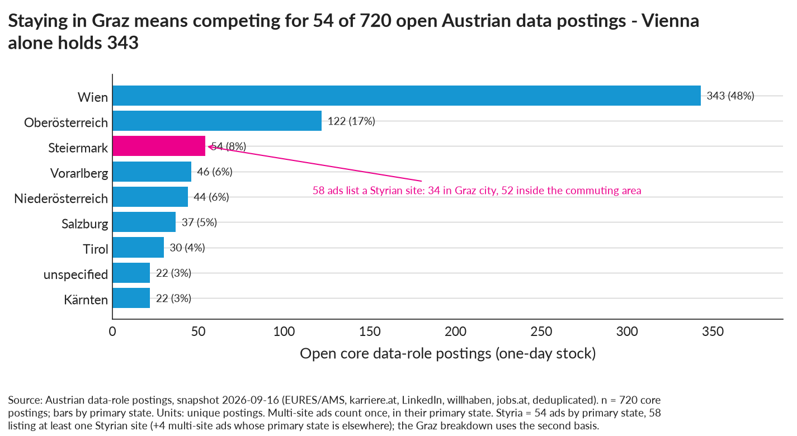](../outputs/figures/BQ01_reachable_market.png)

*Relationship:* comparison across categories · *mark:* `horizontal_bar` (bivariate-simple) · *units:* unique postings

*Built from:* `T03a_state_counts.csv`, `T03c_styria_cities.csv`

*Read with:* One-day stock of open advertisements, not yearly demand. The official yearly series (JB05) puts Styria higher, at 13.6 % of the national flow. Counting every ad that lists a Styrian site (the location-flag basis of T02/T04a/T07e) Styria has 58 postings, 52 of them in the Graz commuting area, and Vienna 350.

*Attached in:* `docs/market-guide.md`, `CAREER_DECISION_MAP.md`

## BQ02_regional_trend

**Q. Is the Graz market growing or shrinking while I spend a year preparing?**

On the official yearly series Styria is +34% against 2020 (224 → 300 ads) while Austria is -28% and Vienna is -48% off its 2022 peak - the only large region holding its level.

[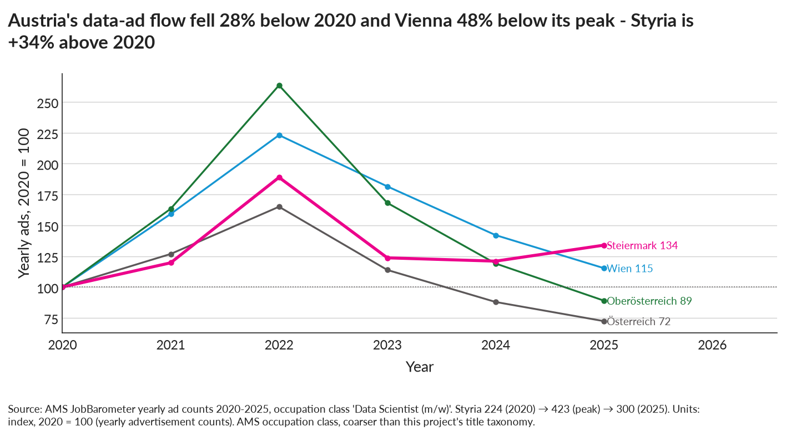](../outputs/figures/BQ02_regional_trend.png)

*Relationship:* trend over time · *mark:* `multi_line` (bivariate-dual) · *units:* index, 2020 = 100

*Built from:* `JB01_yearly_counts_long.csv`

*Read with:* A coarse AMS occupation class ('Data Scientist (m/w)'), not this project's title taxonomy; counts advertisements, not hires.

*Attached in:* `docs/market-guide.md`, `CAREER_DECISION_MAP.md`

## BQ03_seasonality

**Q. Should I time my applications by season, or does the cycle swamp the calendar?**

Q4 runs 2%-7% below an average quarter in every sector and Q1 is usually the strongest, but between-year swings are 19-49× the seasonal swing - use Oct-Dec to build and be ready in January, do not wait for a month.

[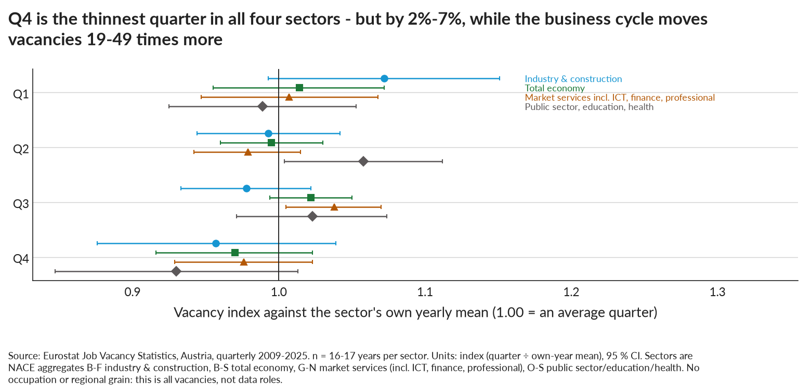](../outputs/figures/BQ03_seasonality.png)

*Relationship:* deviation from target · *mark:* `error_bars` (interval-range) · *units:* index (1.00 = average quarter)

*Built from:* `S01_seasonal_index.csv`, `S06_season_vs_cycle.csv`

*Read with:* Eurostat's Austrian vacancy series has no occupation or regional breakdown; market services (G-N) includes retail, accommodation and food service, so its Q3 peak is not data-job demand.

*Attached in:* `docs/seasonality.md`, `CAREER_DECISION_MAP.md`

## BQ04_styria_employers

**Q. Which Styrian employers actually advertise data roles - who is on my realistic target list?**

32 named employers carry 48 of the 58 ads that list a Styrian site; KNAPP leads with 7, and 7 of the largest 14 advertise analytics, BI or business-analysis roles rather than only engineering.

[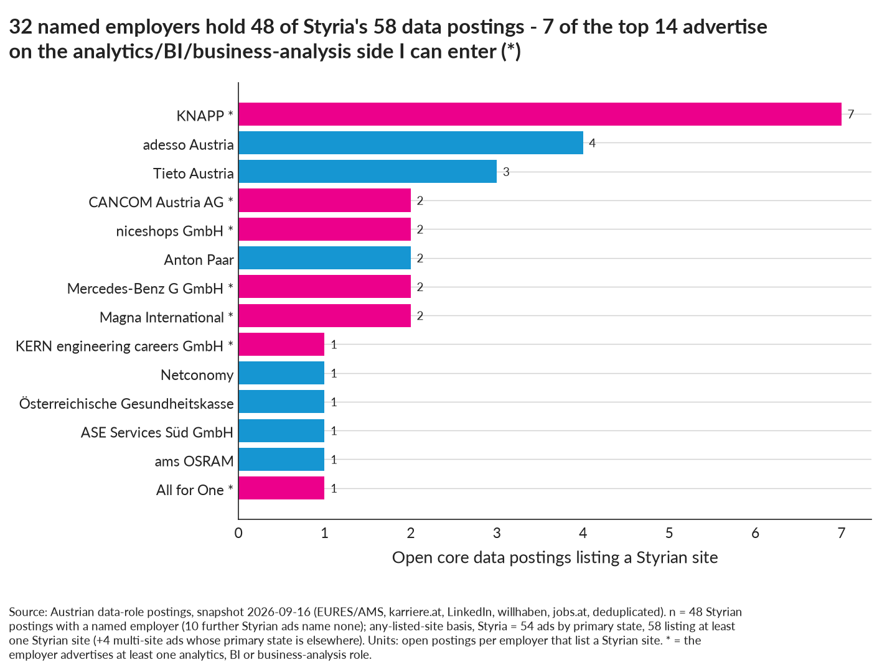](../outputs/figures/BQ04_styria_employers.png)

*Relationship:* ranking · *mark:* `horizontal_bar` (bivariate-simple) · *units:* open postings

*Built from:* `T04a_employers_styria.csv`

*Read with:* A one-day stock: an employer absent here is not an employer that does not hire. 10 Styrian ads (AMS/EURES) name no employer at all. Counts are on the any-listed-site basis (58), not the primary-state count (54).

*Attached in:* `docs/market-guide.md`, `CAREER_DECISION_MAP.md`

## BQ05_family_choice

**Q. Which role family gives me the most openings for the smallest structural gap?**

Data analytics has 87% of its top-15 skills inside my profile with 107 Austrian and 11 Styrian postings, while Data engineering offers 160 postings at only 47% overlap.

[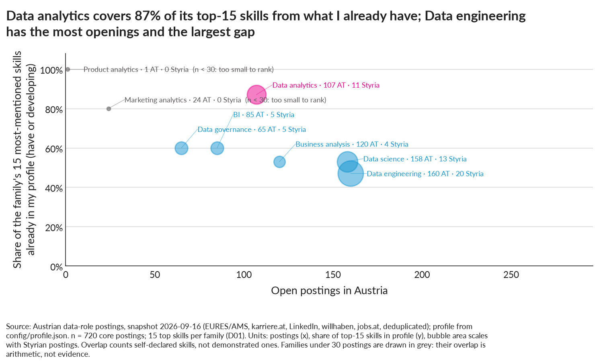](../outputs/figures/BQ05_family_choice.png)

*Relationship:* correlation · *mark:* `bubble` (trivariate) · *units:* postings / share of top-15 skills

*Built from:* `D01_decision_matrix.csv`

*Read with:* Overlap is computed against self-declared profile lists, and measures market size and fit, not ease of being hired. Families below 30 Austrian postings (product and marketing analytics) are shown but not ranked; every Styrian family count is below 30.

*Attached in:* `CAREER_DECISION_MAP.md`, `docs/decision-framework.md`

## BQ06_styria_vs_austria_mix

**Q. Does Graz want a different kind of data person than Austria as a whole?**

Yes: data engineering is 34% of the 58 postings that list a Styrian site against 22% nationally, business analysis falls from 17% to 7%, and marketing and product analytics are absent from Styria entirely.

[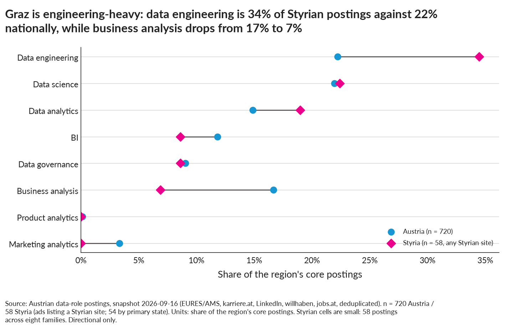](../outputs/figures/BQ06_styria_vs_austria_mix.png)

*Relationship:* ranking · *mark:* `dumbbell` (categorical-multi) · *units:* share of postings

*Built from:* `T02_role_family_counts.csv`

*Read with:* n = 58 for Styria (ads listing a Styrian site; 54 by primary state); every family cell is below 30, so differences are directional.

*Attached in:* `docs/market-guide.md`, `CAREER_DECISION_MAP.md`

## BQ07_ranking_sensitivity

**Q. Is my family ranking a real signal, or an artefact of how I weighted the criteria?**

The top three (engineering, science, analytics) hold under all four weightings and data analytics stays at rank 3; only the order inside the top two moves, so the ordering is not a weighting artefact.

[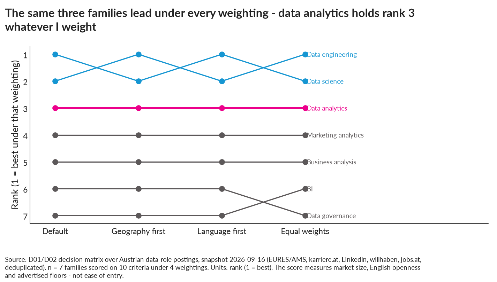](../outputs/figures/BQ07_ranking_sensitivity.png)

*Relationship:* ranking · *mark:* `bump` (categorical-multi) · *units:* rank

*Built from:* `D02_sensitivity.csv`, `D01_decision_matrix.csv`

*Read with:* The matrix ranks market attractiveness, not probability of being hired; no Styrian family cell reaches n = 30, so no path is 'robust' under the project's own rule.

*Attached in:* `CAREER_DECISION_MAP.md`

## BQ08_demanded_skills

**Q. Which tools do Austrian employers actually name - and how much of that list do I already hold?**

SQL (40%) and Python lead the list, and 9 of the 10 most-mentioned items are already in my have-or-developing profile; the intervals separate the top tier cleanly from everything under 10 %.

[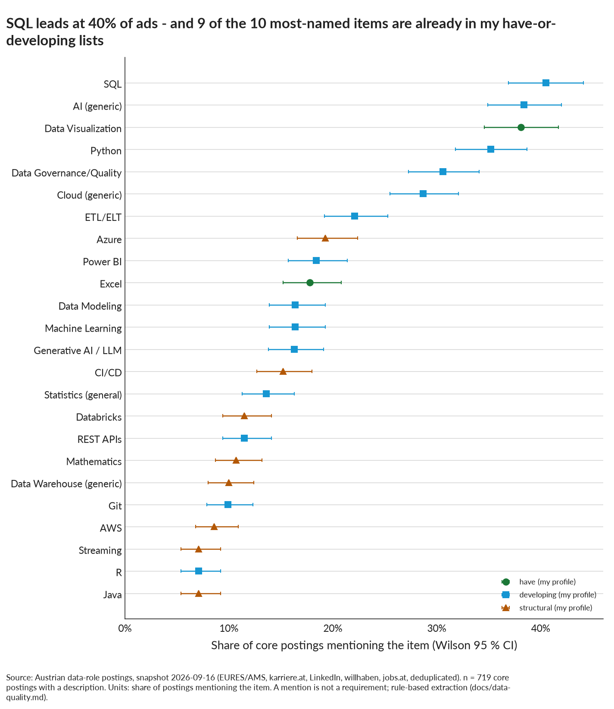](../outputs/figures/BQ08_demanded_skills.png)

*Relationship:* ranking · *mark:* `error_bars` (interval-range) · *units:* share of postings

*Built from:* `T05_skills_all_tech.csv`, `config/profile.json`

*Read with:* Shares count ads that *mention* an item, never ads that require it; the profile status is self-declared, not demonstrated.

*Attached in:* `docs/market-guide.md`, `CAREER_DECISION_MAP.md`

## BQ09_learning_priorities

**Q. If I can only learn a few more things this year, which ones open the most doors?**

SQL, Python, Data Governance/Quality, ETL/ELT are the NOW set - each named in 22%-40% of ads and each a top-15 skill in several families; Power BI, data modelling, GenAI and REST follow as NEXT.

[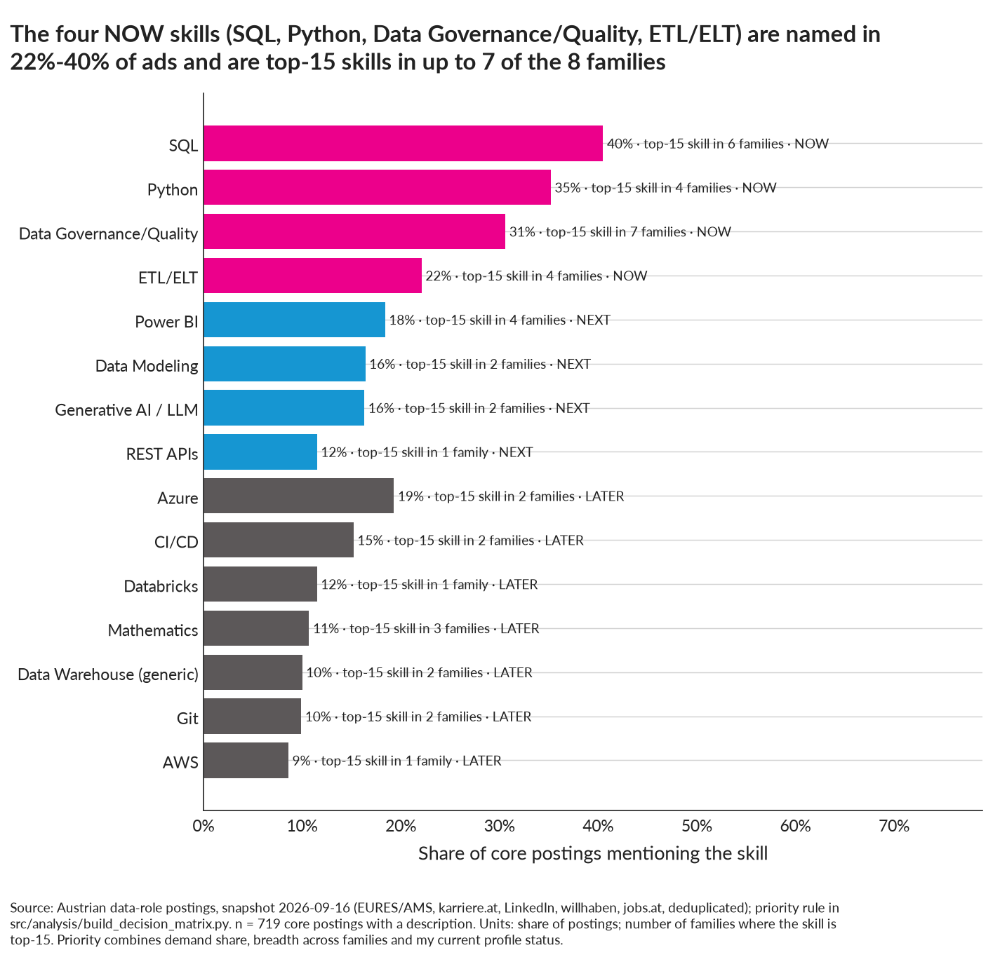](../outputs/figures/BQ09_learning_priorities.png)

*Relationship:* ranking · *mark:* `horizontal_bar` (bivariate-simple) · *units:* share of postings

*Built from:* `D04_learning_priorities.csv`

*Read with:* Priority is a demand-and-breadth heuristic, not evidence that learning the skill changes a hiring outcome.

*Attached in:* `CAREER_DECISION_MAP.md`, `docs/career-map.md`

## BQ10_skill_cooccurrence

**Q. What is the minimum credible stack - which skills do employers ask for together?**

SQL is the hub: 59% of SQL ads also name Python and 68% of Python ads name SQL, while Power BI's strongest partner is reporting wording rather than Python - a SQL + Python + dashboard combination covers the densest part of the matrix.

[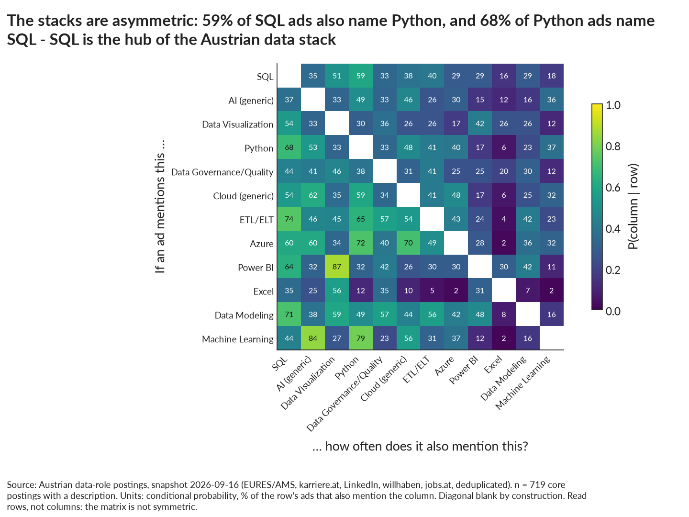](../outputs/figures/BQ10_skill_cooccurrence.png)

*Relationship:* correlation · *mark:* `heatmap` (trivariate) · *units:* conditional probability

*Built from:* `T06_cooccurrence_pairs.csv`, `T05_skills_all_tech.csv`

*Read with:* Co-mention in an advertisement, not a statement about how the tools are used together in the job.

*Attached in:* `docs/market-guide.md`, `CAREER_DECISION_MAP.md`

## BQ11_intern_vs_junior

**Q. The two entry doors are intern and junior - do they ask for different things?**

Yes: junior ads lean to Data Governance/Quality (+19 pp) and ETL, intern ads to Power BI and Excel; SQL is high in both, so it is the one skill that opens either door.

[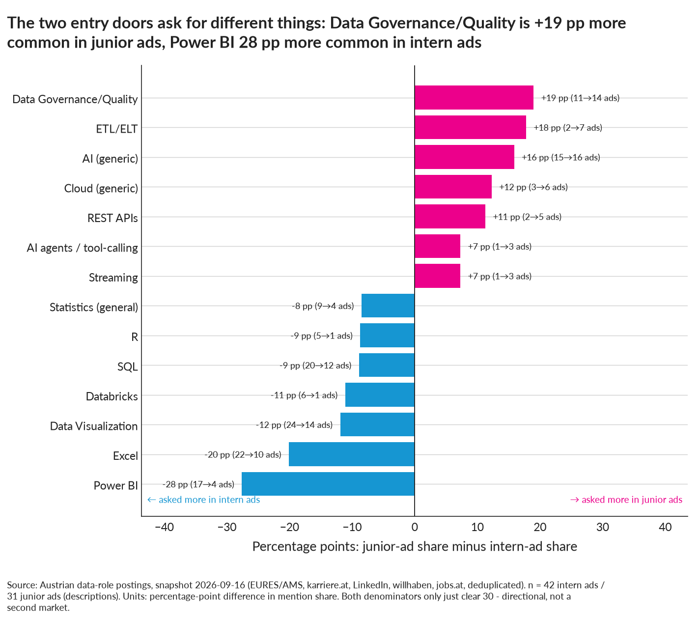](../outputs/figures/BQ11_intern_vs_junior.png)

*Relationship:* deviation from target · *mark:* `diverging_bar` (categorical-value) · *units:* percentage points

*Built from:* `T17_skill_divergence_intern_vs_junior.csv`

*Read with:* n = 42 and n = 31: differences under roughly 15 pp are inside the noise of these cell sizes.

*Attached in:* `docs/market-guide.md`, `CAREER_DECISION_MAP.md`

## BQ12_german_addressable_market

**Q. With German at A2-B1, how many Graz jobs can I honestly apply to today?**

Between 8 and 37 of the 58 open ads that list a Styrian site, depending on which reading you take; the strictest reading (English-written and silent on German) leaves 8 in Styria and 6 in the Graz area.

[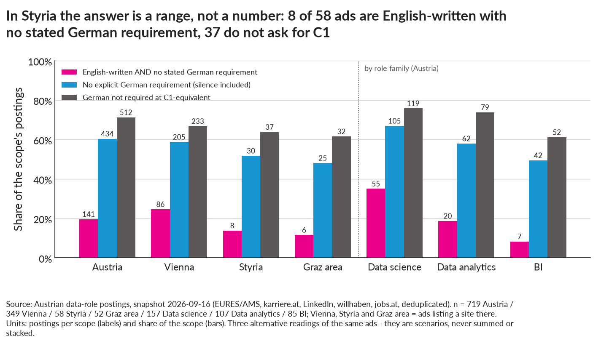](../outputs/figures/BQ12_german_addressable_market.png)

*Relationship:* comparison across categories · *mark:* `grouped_bar` (bivariate-dual) · *units:* postings / share of scope

*Built from:* `T07e_addressable_market_scenarios.csv`

*Read with:* 'English-written and silent on German' is not 'English-only': German may still be expected. Whether a stated requirement is negotiable is not measured anywhere in this project.

*Attached in:* `docs/market-guide.md`, `CAREER_DECISION_MAP.md`

## BQ13_language_by_family

**Q. Which role family gives my English the most room and my German the least resistance?**

Data science: 44% of its ads are written in English and 33% state a German requirement, against BI at 8% English and 51% German - the language dimension moves more between families than the skill lists do.

[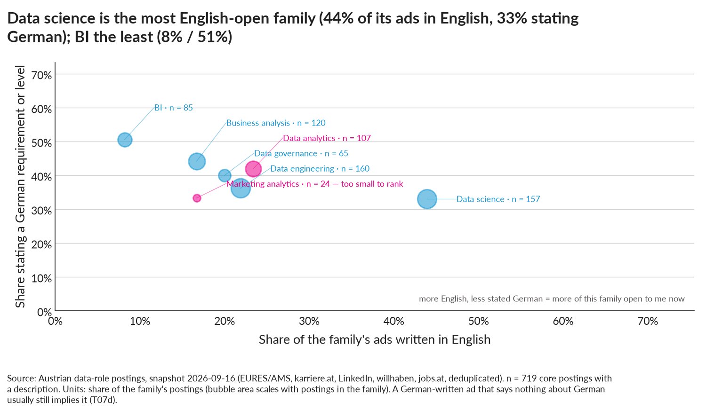](../outputs/figures/BQ13_language_by_family.png)

*Relationship:* correlation · *mark:* `bubble` (trivariate) · *units:* share of postings

*Built from:* `T07c_posting_language_by_family.csv`, `T07_german_requirement_by_role_family.csv`

*Read with:* Marketing analytics (n = 24) and product analytics (n = 1) carry cells too small to separate.

*Attached in:* `docs/market-guide.md`, `CAREER_DECISION_MAP.md`

## BQ14_degree_requirement

**Q. Does not holding a data/informatics degree close the door?**

It narrows it rather than closing it: 25%-38% of ads state a degree as a condition depending on the family, 26%-39% never mention education at all, and a third of the conditional ads add 'or equivalent experience'.

[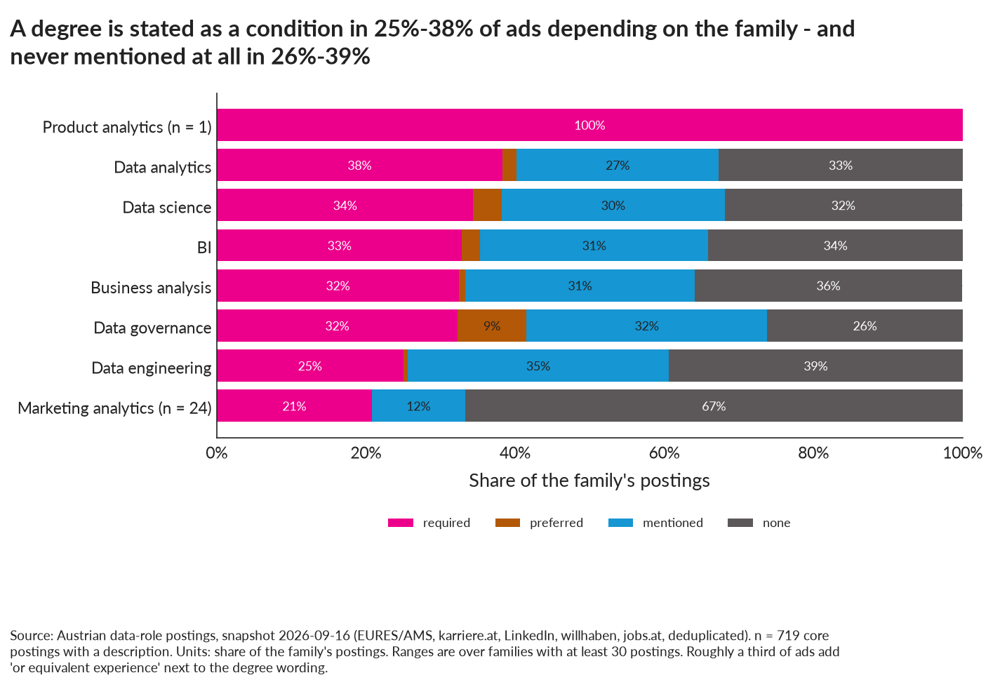](../outputs/figures/BQ14_degree_requirement.png)

*Relationship:* part to whole · *mark:* `stacked_bar` (categorical-multi) · *units:* share of postings

*Built from:* `T11e_degree_requirement_strength_by_family.csv`

*Read with:* Wording strength, not hiring practice: no evidence here on how degree wording is applied in screening.

*Attached in:* `docs/market-guide.md`, `CAREER_DECISION_MAP.md`

## BQ15_salary_by_family

**Q. What do the families advertise as a floor, and what does entering through analytics cost me?**

Data analytics advertises a median minimum of €47.8k against data engineering's €55.4k - a €7.5k difference at the entry door, with overlapping interquartile ranges.

[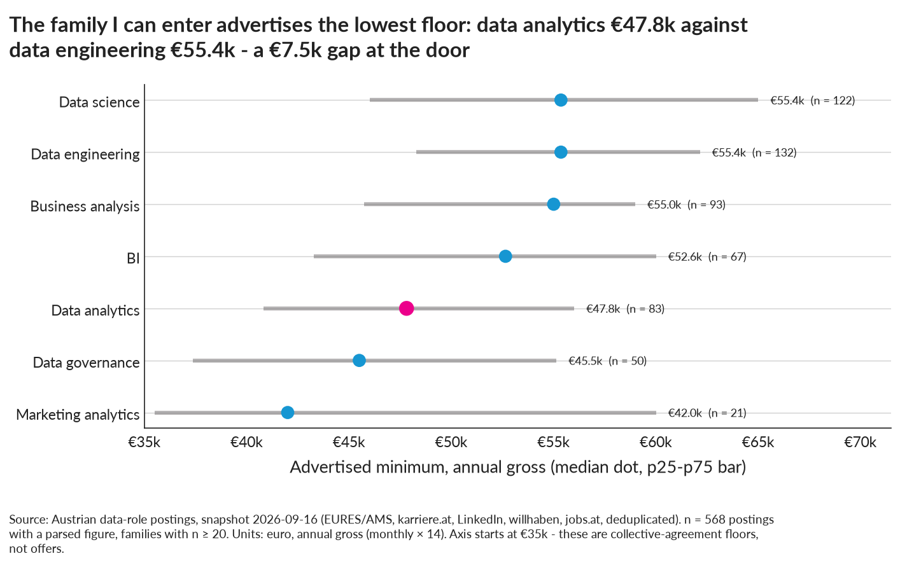](../outputs/figures/BQ15_salary_by_family.png)

*Relationship:* ranking · *mark:* `dot_plot` (categorical-value) · *units:* EUR, annual gross

*Built from:* `T09b_salary_by_role_family.csv`

*Read with:* 81 % of parsed figures are a single collective-agreement minimum; 53 % of ads say they pay above it. These are legal floors, not offers and not pay.

*Attached in:* `docs/market-guide.md`, `CAREER_DECISION_MAP.md`

## BQ16_salary_by_seniority

**Q. What does entering on a junior label actually cost me, given 20 years of prior experience?**

The junior median floor is €42.0k against €52.2k for an unlabelled ad and €60.0k for a senior one - a €10.2k penalty for the label, which is why the 57.5 % of ads carrying no seniority word matter more than the junior ones.

[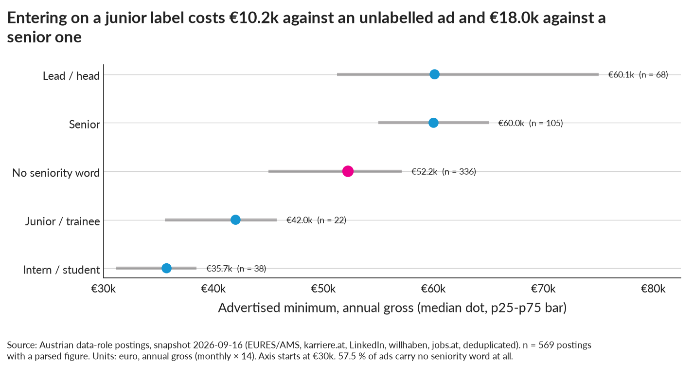](../outputs/figures/BQ16_salary_by_seniority.png)

*Relationship:* ranking · *mark:* `dot_plot` (categorical-value) · *units:* EUR, annual gross

*Built from:* `T09b_salary_by_seniority.csv`

*Read with:* Seniority is read from the advertisement's title, and the figure is an advertised floor, not an offer. Junior n = 22.

*Attached in:* `docs/market-guide.md`

## BQ17_salary_by_skill

**Q. Which skills sit in the better-paying ads - is the learning list also the earning list?**

Ads mentioning Data Lake/Lakehouse carry €60.0k floors against €43.7k for Excel ads - engineering and ML wording sits €16.3k above reporting and spreadsheet wording, so the NOW list and the pay list point the same way.

[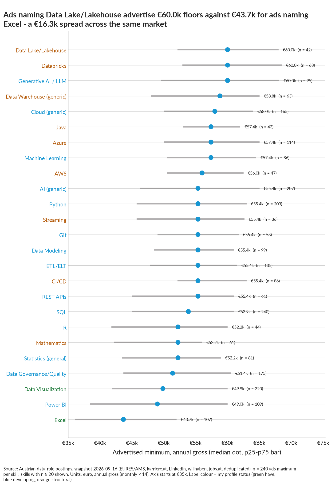](../outputs/figures/BQ17_salary_by_skill.png)

*Relationship:* ranking · *mark:* `dot_plot` (categorical-value) · *units:* EUR, annual gross

*Built from:* `T09d_salary_by_skill.csv`, `config/profile.json`

*Read with:* This is the floor of the ads that *mention* a skill, confounded with seniority, family and employer size. It is not the price of the skill.

*Attached in:* `docs/market-guide.md`

## BQ18_work_model

**Q. Is hybrid real, and is chasing fully-remote roles from Graz a trap?**

Fully remote is 2% of ads (14 postings) - a trap as a strategy; hybrid or home-office wording covers about half the market, and Styria matches the national pattern, so commuting distance to Graz stays the binding constraint.

[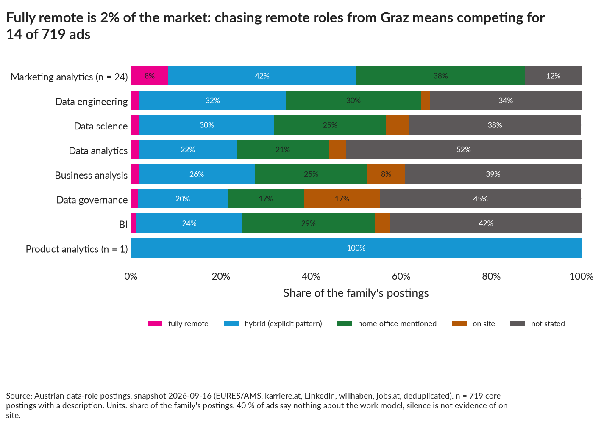](../outputs/figures/BQ18_work_model.png)

*Relationship:* part to whole · *mark:* `stacked_bar` (categorical-multi) · *units:* share of postings

*Built from:* `T10_remote_by_family.csv`, `T10_remote_overall.csv`

*Read with:* Wording in the advertisement, not the arrangement actually offered; 40 % of ads are silent.

*Attached in:* `docs/market-guide.md`, `CAREER_DECISION_MAP.md`

## BQ19_side_doors

**Q. Can I get into data work through a non-data title - do those jobs use the same tools?**

Yes, and it is the larger channel: 83% of Styrian ads mentioning Python and 88% of those mentioning SQL sit under non-data titles (controlling, engineering, research), so data skills are demanded far more widely than data titles are advertised.

[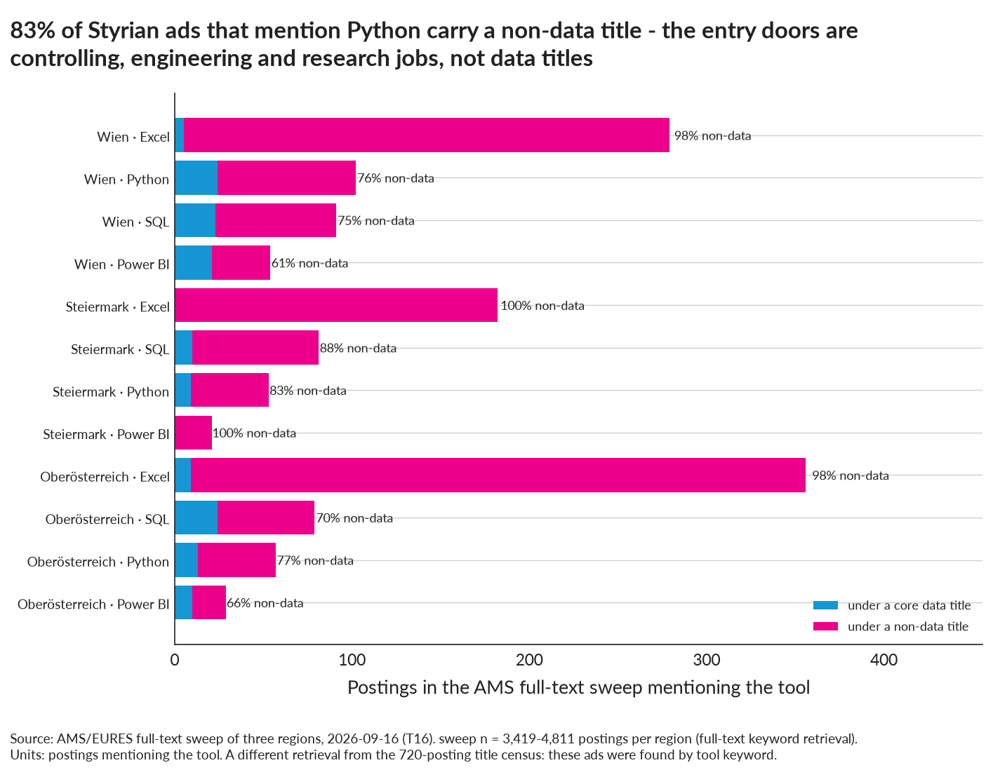](../outputs/figures/BQ19_side_doors.png)

*Relationship:* part to whole · *mark:* `stacked_bar` (categorical-multi) · *units:* postings

*Built from:* `T16_adjacent_demand_by_region.csv`

*Read with:* Covers only the AMS feed of three regions and retrieves by full-text keyword, so it is not comparable to the 720-posting title census.

*Attached in:* `docs/market-guide.md`, `docs/career-map.md`

## BQ20_competition_density

**Q. How many visible candidates am I standing next to per opening, depending on the label I choose?**

Data science shows 4.0 declared candidates per posting (2.9 in Styria) against 0.36 for engineering and 1.21 for analytics - calling myself a data scientist puts me in the densest queue on the board.

[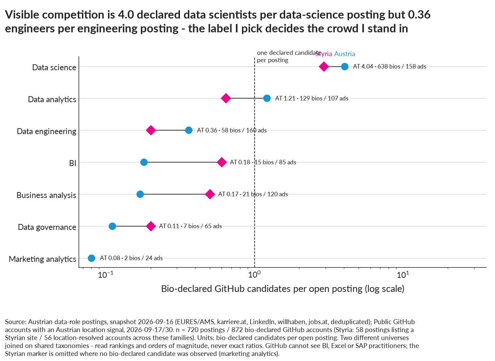](../outputs/figures/BQ20_competition_density.png)

*Relationship:* ranking · *mark:* `dot_plot` (categorical-value) · *units:* candidates per posting

*Built from:* `DS01_demand_supply_role_families.csv`

*Read with:* GitHub over-represents engineers, researchers and students and is blind to BI/Excel/SAP work, so a low density is partly real scarcity and partly invisibility. Vienna counts are lower bounds.

*Attached in:* `CAREER_SUPPLY_DEMAND_MAP.md`, `docs/supply-findings.md`

## BQ21_evidence_gap

**Q. Where is a month of portfolio work worth most - what is demanded often and demonstrated rarely?**

SQL (41% of ads vs 10% of candidates with project evidence), data quality/validation, dimensional modelling and Azure pipelines sit furthest below the diagonal among the capabilities GitHub can actually see - and business framing sits with them. Power BI, Excel and SAP are equally demanded but cannot be closed with public code.

[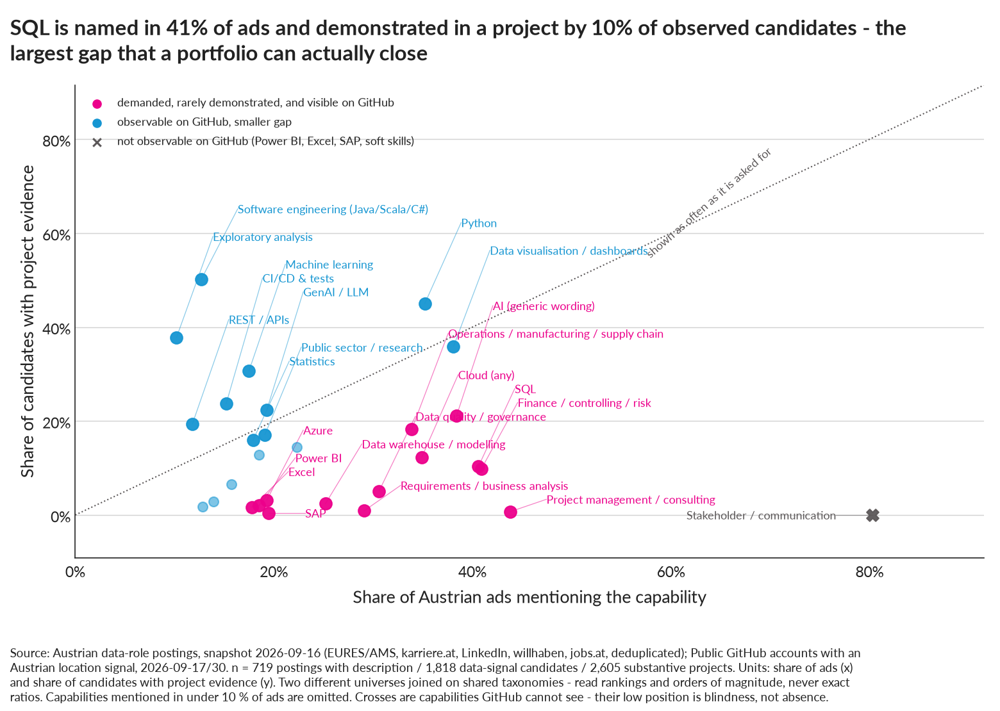](../outputs/figures/BQ21_evidence_gap.png)

*Relationship:* correlation · *mark:* `scatter` (bivariate-simple) · *units:* share of ads / share of candidates

*Built from:* `DS10_demand_supply_capability_evidence.csv`

*Read with:* Two universes, one taxonomy: the axes are not the same denominator and the diagonal is a reading aid, not an identity. A capability marked not-observable is invisible to this measurement.

*Attached in:* `CAREER_SUPPLY_DEMAND_MAP.md`, `CAREER_DECISION_MAP.md`, `docs/project-evidence-map.md`, `docs/supply-findings.md`, `docs/career-map.md`

## BQ22_crowded_vs_scarce

**Q. Which skills is everyone already showing, and which ones would actually distinguish me?**

Jupyter, notebooks and deep-learning frameworks run far ahead of demand (+50 pp), while SQL, Power BI, Azure and data modelling run far behind it - a portfolio built only of notebooks competes in the densest part of the pool.

[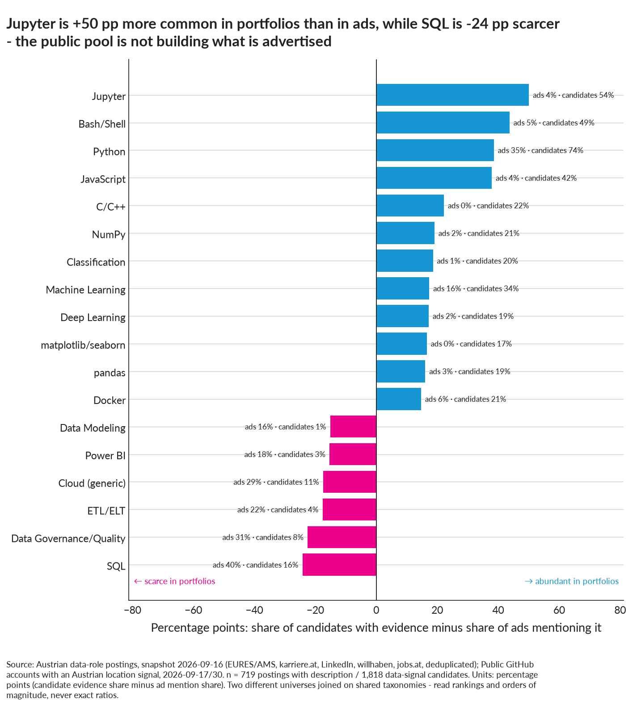](../outputs/figures/BQ22_crowded_vs_scarce.png)

*Relationship:* deviation from target · *mark:* `diverging_bar` (categorical-value) · *units:* percentage points

*Built from:* `DS03_demand_supply_skills.csv`

*Read with:* Supply shares come from public code and profiles; tools that leave no code trace are understated by construction.

*Attached in:* `CAREER_SUPPLY_DEMAND_MAP.md`, `CAREER_DECISION_MAP.md`, `docs/supply-findings.md`

## BQ23_project_formats

**Q. What does a normal public portfolio in Austria actually contain - and what would stand out?**

Notebooks (43%) and Python packages dominate, while SQL files (1.2%), dashboards, pipelines, tests and CI are rare - the packaging that maps onto advertised work is precisely the packaging almost nobody publishes.

[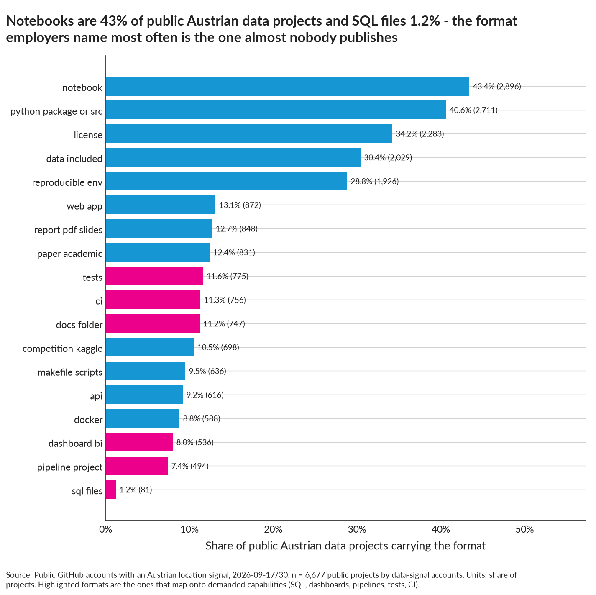](../outputs/figures/BQ23_project_formats.png)

*Relationship:* ranking · *mark:* `horizontal_bar` (bivariate-simple) · *units:* share of projects

*Built from:* `C17_project_formats.csv`

*Read with:* Format detection is rule-based over repository file trees; a private or client project leaves no trace here.

*Attached in:* `CAREER_SUPPLY_DEMAND_MAP.md`, `docs/supply-findings.md`

## BQ24_readme_anatomy

**Q. If a hiring manager opens one of my repositories, what does the average one give them - and what is missing?**

Public READMEs are software READMEs: 66% say how to run the code, but only 25% state a result, 12% state limitations and 11% state a business question - question → data → method → result → limitation → decision is the rarest structure in the pool and the one my 20 years of marketing work can write without learning anything new.

[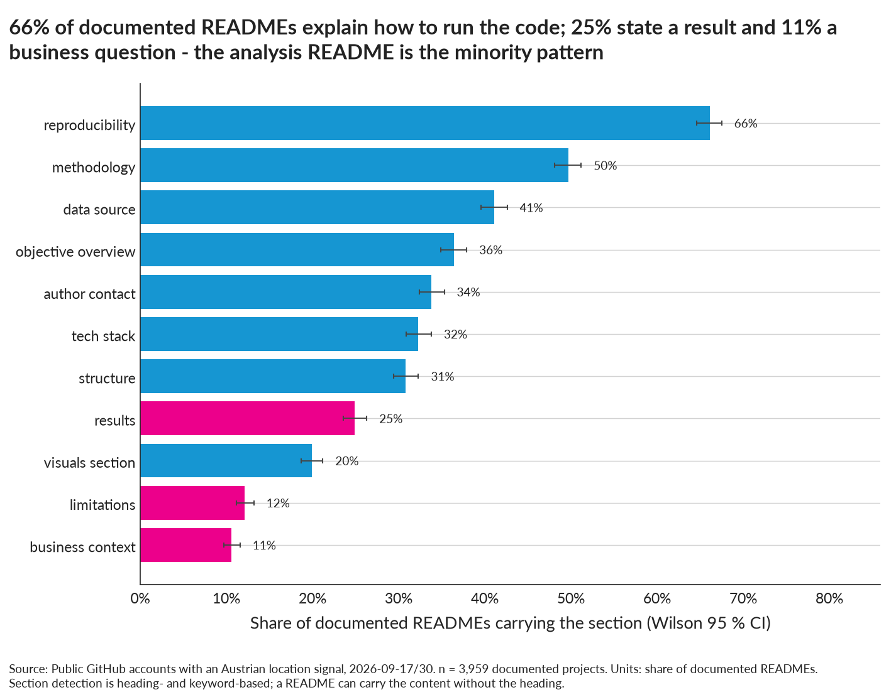](../outputs/figures/BQ24_readme_anatomy.png)

*Relationship:* ranking · *mark:* `horizontal_bar` (bivariate-simple) · *units:* share of documented READMEs

*Built from:* `C19_readme_patterns.csv`

*Read with:* Detects headings and keywords, not quality; a README with the section can still be empty of substance.

*Attached in:* `CAREER_SUPPLY_DEMAND_MAP.md`, `CAREER_DECISION_MAP.md`, `docs/supply-findings.md`

## BQ25_seniority_mismatch

**Q. Ads keep asking for seniors - am I actually competing with seniors?**

Not in the visible pool: 32% of ads carry senior or lead wording (senior alone 19%) against 10% of public profiles, and 17% of profiles are students - so twenty years of business experience plus documented projects is an unusual combination where the portfolios are, even though the ads ask for it.

[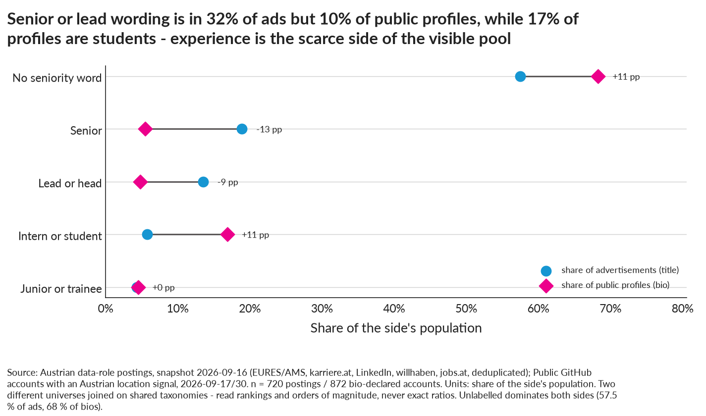](../outputs/figures/BQ25_seniority_mismatch.png)

*Relationship:* deviation from target · *mark:* `dumbbell` (categorical-multi) · *units:* share of population

*Built from:* `DS07_demand_supply_seniority.csv`

*Read with:* Seniority read from ad titles and bio wording; years of experience are not observable on either side, and senior practitioners publish less.

*Attached in:* `CAREER_SUPPLY_DEMAND_MAP.md`, `docs/supply-findings.md`

## BQ26_marketing_x_data

**Q. My 20 years are in marketing - does the marketing × data intersection actually exist as a space I can own?**

It exists in projects, not in titles: 197 of 1,818 observed candidates have a marketing-themed project, 64 pair it with Python and SQL and only 23 add experimentation or causal work - but demand is only 24 marketing-analytics ads nationally and 0 in Styria, so it is a differentiator inside analyst applications, not a local job title.

[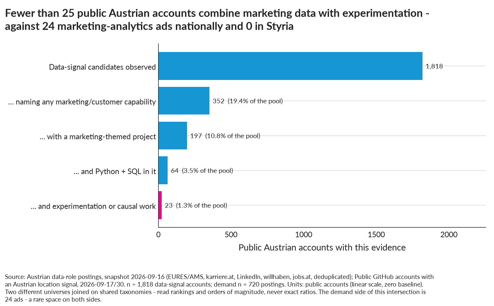](../outputs/figures/BQ26_marketing_x_data.png)

*Relationship:* ranking · *mark:* `horizontal_bar` (bivariate-simple) · *units:* accounts

*Built from:* `DS12_marketing_x_data_intersection.csv`, `C24_marketing_data_intersection.csv`

*Read with:* Each step is a subset of the one above it. Public GitHub does not narrate career changes (3.4 % explicit, marketing 0), so transitioners are invisible here rather than absent.

*Attached in:* `CAREER_SUPPLY_DEMAND_MAP.md`, `CAREER_DECISION_MAP.md`, `docs/supply-findings.md`

## BQ27_population_funnel

**Q. When I read '40 % of ads', 40 % of what exactly - and how did 12,429 rows become that denominator?**

12,429 raw rows deduplicate to 10,945 unique postings, of which 720 carry a core data-role title - that is the denominator behind almost every share in the project, and only 58 of them list a Styrian site (52 of those in the Graz commuting area).

[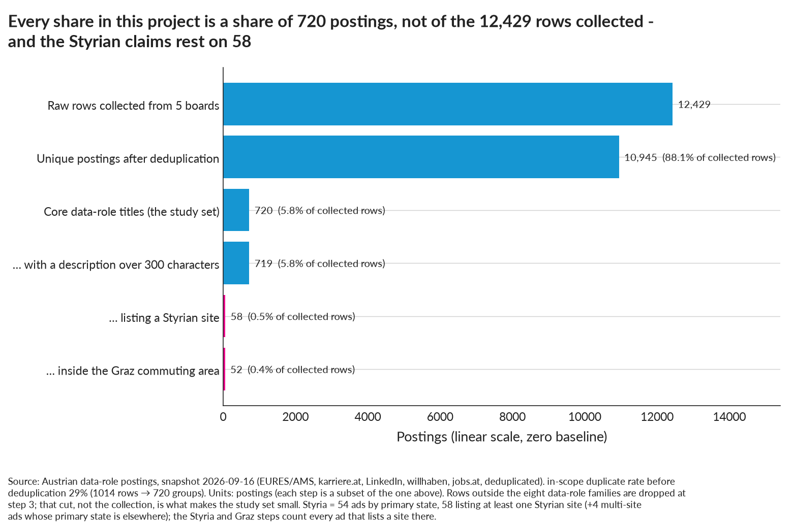](../outputs/figures/BQ27_population_funnel.png)

*Relationship:* part to whole · *mark:* `horizontal_bar` (bivariate-simple) · *units:* postings

*Built from:* `outputs/market_summary.json`, `Q04_duplicates.csv`, `T01_source_coverage.csv`

*Read with:* Each bar is a subset of the one above it, so the bars must never be summed. Text-derived shares use the 719 postings with a description, not all 720. The Styria steps count every ad that lists a Styrian site; by primary state Styria has 54.

*Attached in:* `docs/data-quality.md`, `docs/methodology.md`, `docs/market-guide.md`

## BQ28_classification_precision

**Q. How much of what I am reading is in the wrong family - can I trust the role labels at all?**

After the D-012 audit, strict precision runs from 64% (Data governance, where IT-analyst and process-owner titles leak in) to 100%, lenient from 90% to 100% - good enough for ranking families, not for quoting a single family's count to the posting.

[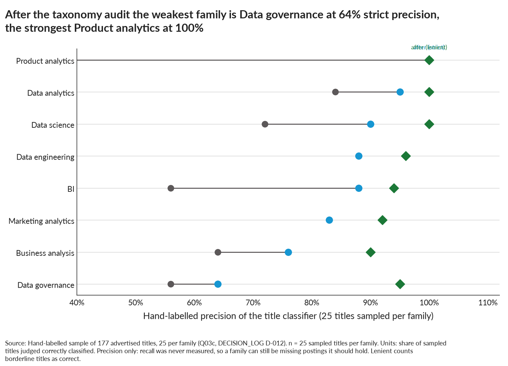](../outputs/figures/BQ28_classification_precision.png)

*Relationship:* deviation from target · *mark:* `dumbbell` (categorical-multi) · *units:* share of sampled titles

*Built from:* `Q03c_precision_summary.csv`

*Read with:* 25 titles per family is a small audit sample, and recall is unmeasured: this bounds false positives only, never false negatives.

*Attached in:* `docs/data-quality.md`, `docs/market-guide.md`

## BQ29_styria_sample_sizes

**Q. Which of my Styrian conclusions are actually too small to carry a decision?**

All of them, by the project's own rule: the largest Styrian family cell is 20 postings against a robustness threshold of 30, and four families sit at five or fewer - so Styrian findings are read as counts and directions, never as percentages.

[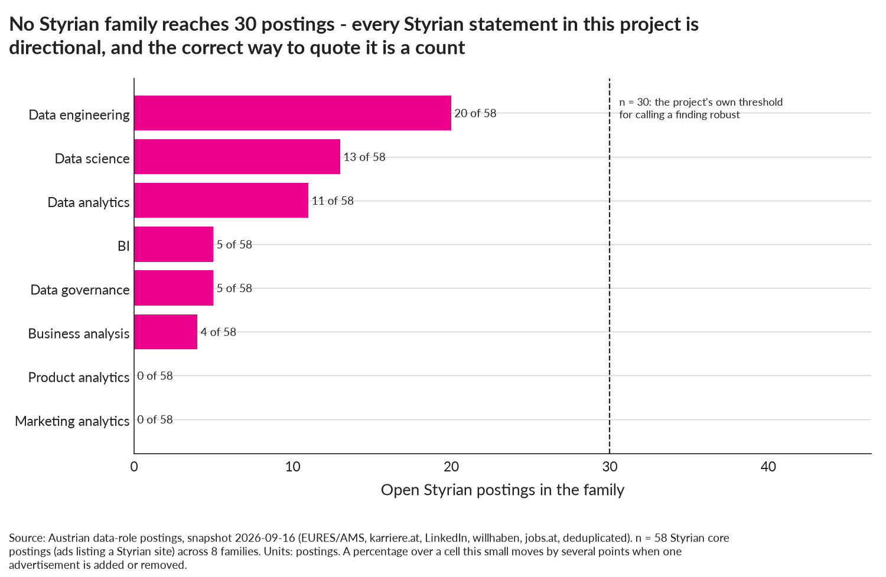](../outputs/figures/BQ29_styria_sample_sizes.png)

*Relationship:* comparison across categories · *mark:* `horizontal_bar` (bivariate-simple) · *units:* postings

*Built from:* `T02_role_family_counts.csv`

*Read with:* The official yearly series (JB05) puts Styria at 13.6 % of the national flow against 7.5% here (by primary state; 8.1% counting every ad with a Styrian site), so this snapshot may also understate Styrian volume, not only measure it imprecisely.

*Attached in:* `docs/limitations.md`, `CAREER_DECISION_MAP.md`

## BQ30_source_coverage

**Q. How much of the Austrian market can this dataset simply not see?**

LinkedIn and EURES/AMS carry most of the 720 core postings, and the corporate white-collar segment is missing entirely: StepStone.at and Indeed.at returned HTTP 403, and company career pages, university portals and hokify were never collected - so the corporate share of Austrian data demand is an unmeasured gap, not a measured absence.

[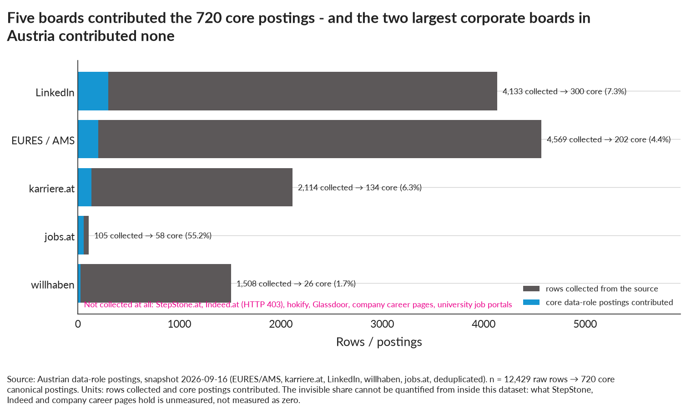](../outputs/figures/BQ30_source_coverage.png)

*Relationship:* comparison across categories · *mark:* `horizontal_bar` (bivariate-simple) · *units:* rows / postings

*Built from:* `T01_source_coverage.csv`, `T01b_source_overlap_in_scope.csv`

*Read with:* Only 20 % of core postings were seen on more than one source, so the boards are largely disjoint universes; a missing board is a missing slice, not a redundant one.

*Attached in:* `docs/limitations.md`, `docs/data-sources.md`

## BQ31_posting_freshness

**Q. How fresh is the market I am reading - am I looking at this week or at leftovers?**

It depends entirely on the board: karriere.at shows a median age of 5 days and EURES/AMS 41 days, with 34 core postings older than 180 days - so the snapshot is a mixture of fresh demand and evergreen advertisements, and source mix drives apparent freshness.

[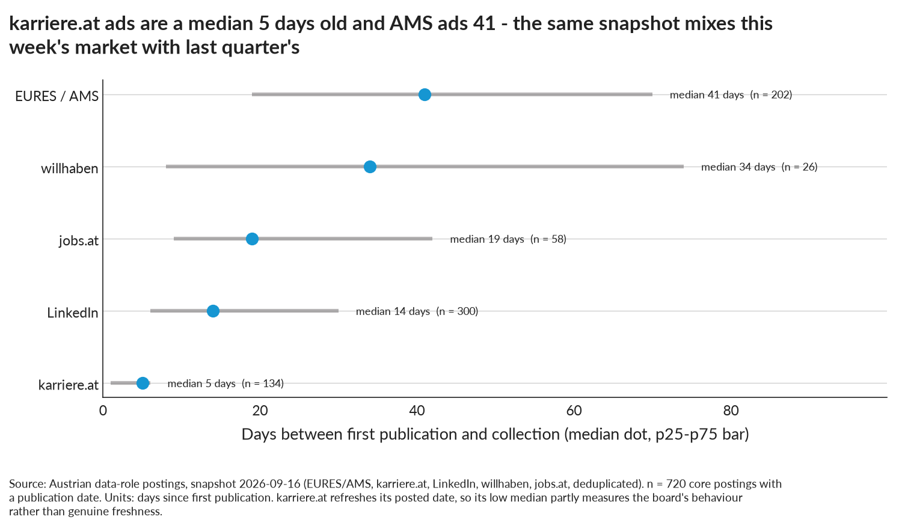](../outputs/figures/BQ31_posting_freshness.png)

*Relationship:* distribution · *mark:* `dot_plot` (categorical-value) · *units:* days

*Built from:* `T13b_posting_age_by_source.csv`, `Q05a_stale.csv`

*Read with:* Publication dates are board-reported and some boards refresh them; age is a lower bound on how long a vacancy has really been open.

*Attached in:* `docs/data-quality.md`, `docs/market-guide.md`

## BQ32_salary_evidence

**Q. When an advertisement shows me a salary, what am I actually looking at?**

A legal floor in most cases: 569 of 720 ads state a figure, 460 of those are a single minimum and only 109 are a range; 424 name the collective agreement and 385 say they pay above it - so every salary figure in this project is the bottom of a negotiation, never the market price.

[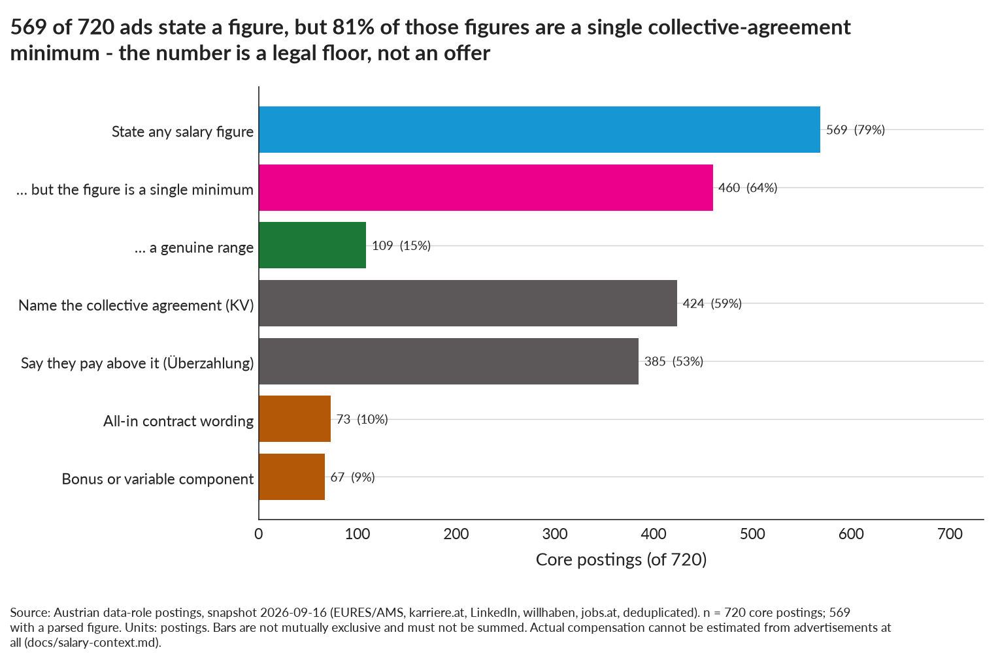](../outputs/figures/BQ32_salary_evidence.png)

*Relationship:* comparison across categories · *mark:* `horizontal_bar` (bivariate-simple) · *units:* postings

*Built from:* `T09_salary_coverage.csv`, `T09a_salary_basis_by_source.csv`

*Read with:* Categories overlap by construction (an ad can state a minimum, name the KV and mention a bonus). LinkedIn omits a figure in 41 % of its core ads, so coverage is also a source-mix artefact.

*Attached in:* `docs/market-guide.md`, `docs/data-quality.md`, `docs/salary-context.md`

## BQ33_employer_structure

**Q. Who is actually behind these postings - is demand concentrated in a few employers I could target?**

No: 387 named employers share 580 postings, the top ten hold only 10.9% of them and agencies 4.5% - the market is fragmented, so a target list is long rather than short; 140 postings (19%) name no employer at all and are invisible to any target list.

[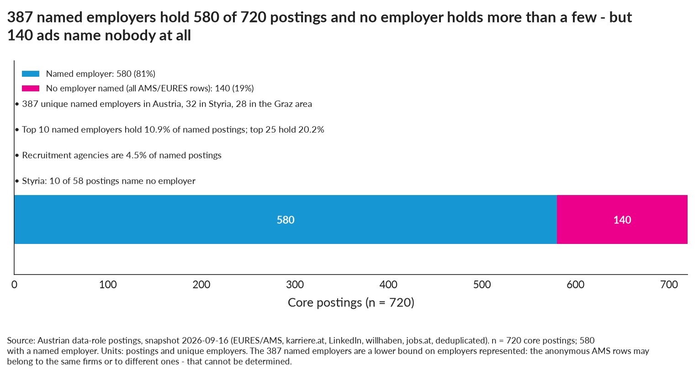](../outputs/figures/BQ33_employer_structure.png)

*Relationship:* part to whole · *mark:* `stacked_bar` (categorical-multi) · *units:* postings

*Built from:* `T04b_employer_concentration.csv`, `T04_employers.csv`, `T04a_employers_styria.csv`

*Read with:* Employer identity is taken from the advertisement; the same firm advertising under a group name and an agency is counted twice, and the anonymous AMS rows cannot be attributed at all.

*Attached in:* `docs/market-guide.md`

## BQ34_german_level_demanded

**Q. When an advertisement names a German level, which level is it - and is my A2-B1 ever stated as enough?**

Essentially never: C1-equivalent wording appears in 36% of core ads (261 postings) and B2/good in 12%, while B1 or below is named as sufficient in 6 advertisements in the whole corpus - so the realistic route is the 41% of ads that state no level at all, not the ones that state a low one.

[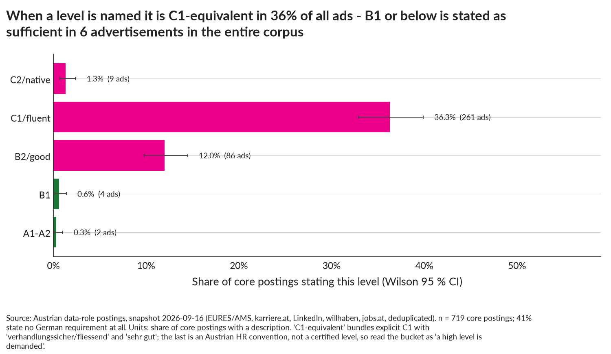](../outputs/figures/BQ34_german_level_demanded.png)

*Relationship:* ranking · *mark:* `horizontal_bar` (bivariate-simple) · *units:* share of postings

*Built from:* `T07a_german_level_overall.csv`, `T07_german_requirement_by_overall.csv`

*Read with:* Wording-derived buckets: mapping 'sehr gut' to C1 is an assumption, and silence in a German-written ad usually still implies German (T07d). Whether a stated level is negotiable is not measured.

*Attached in:* `docs/market-guide.md`, `CAREER_DECISION_MAP.md`

## BQ35_tools_vs_libraries

**Q. Do employers ask for frameworks and libraries, or only for languages and tools?**

Only for languages and tools: Python is named in 35% of ads while the most-mentioned Python library (PyTorch) reaches 4.5% - a CV built on library lists speaks a vocabulary employers do not use, while the language, the BI tool and the cloud platform are the words they do use.

[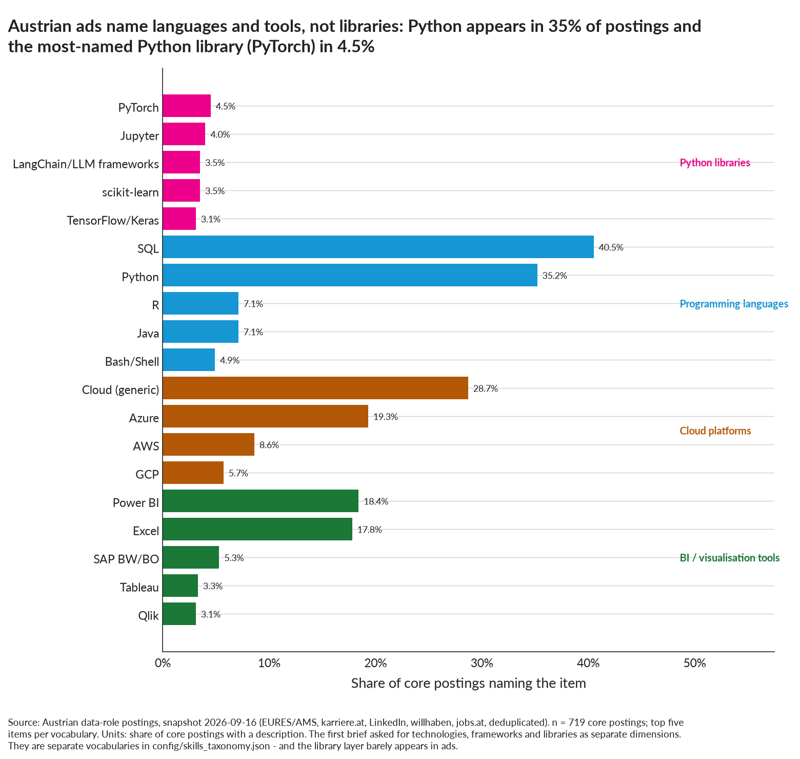](../outputs/figures/BQ35_tools_vs_libraries.png)

*Relationship:* ranking · *mark:* `horizontal_bar` (bivariate-simple) · *units:* share of postings

*Built from:* `T05_skills_programming_languages.csv`, `T05_skills_python_ecosystem.csv`, `T05_skills_bi_tools.csv`, `T05_skills_cloud_platforms.csv`

*Read with:* Absence of a library in an advertisement is not absence in the job: ads compress a stack to its headline names. This measures advertising vocabulary, not the work.

*Attached in:* `docs/market-guide.md`, `CAREER_DECISION_MAP.md`

## BQ36_certifications_both_sides

**Q. Is a certification worth the money and the weeks - does either side of this market care?**

No evidence that it is: 13% of ads mention any certification at all and each specific one stays at or under 3 %, while 3.8% of observed candidates show one and MOOC certificates outnumber vendor ones - certifications differentiate in neither direction here, which makes them the cheapest item to drop from a learning plan.

[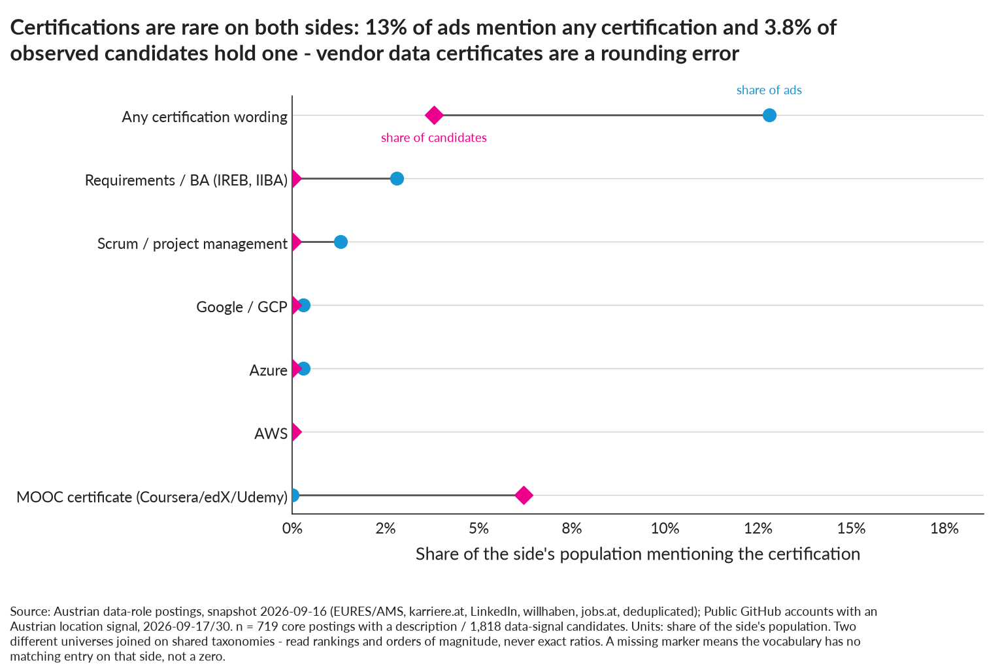](../outputs/figures/BQ36_certifications_both_sides.png)

*Relationship:* deviation from target · *mark:* `dumbbell` (categorical-multi) · *units:* share of population

*Built from:* `T11d_certifications.csv`, `C09_certifications.csv`

*Read with:* Both sides are wording-derived: an employer may still value a certificate it does not advertise, and a candidate may hold one they never mention in a bio or README.

*Attached in:* `docs/market-guide.md`, `CAREER_SUPPLY_DEMAND_MAP.md`

## BQ37_geography_demand_supply

**Q. Is the candidate pool distributed across Austria the way the jobs are?**

Roughly, and both sides pile into Vienna: 343 Viennese ads (by primary state) against at least 478 declared candidates, and in Styria - the only region where the candidate frame is complete - 54 ads by primary state against 56 declared candidates (location-resolved). The structural shape is the same everywhere; Styria differs by being smaller and more industrial on both sides.

[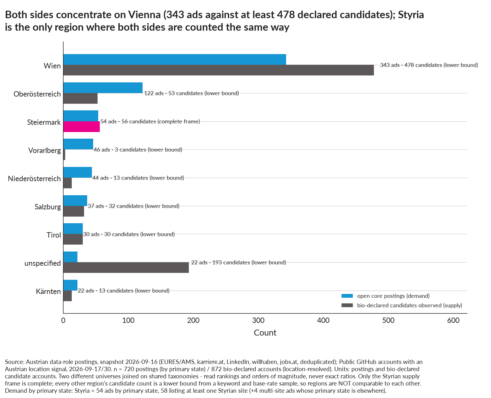](../outputs/figures/BQ37_geography_demand_supply.png)

*Relationship:* comparison across categories · *mark:* `grouped_bar` (bivariate-dual) · *units:* counts

*Built from:* `DS05_demand_supply_geography.csv`

*Read with:* Supply frames differ by region by construction: Styria is a complete GitHub frame, every other state is a keyword plus base-rate sample and therefore a lower bound. Cross-region supply comparison is not valid. Demand is by primary state (T03a); counting every ad that lists a Styrian site gives 58.

*Attached in:* `CAREER_SUPPLY_DEMAND_MAP.md`, `docs/supply-findings.md`

## BQ38_education_both_sides

**Q. Is the pool I am competing with more credentialled than employers actually ask for?**

In its own direction, yes: candidates over-represent data-science degrees and Master's/PhD wording relative to the ads, while the ads name informatics, engineering and business fields more often than candidates do (data-science wording: ads 18% vs candidates 57%) - the credential gap is a mismatch of field, not a simple deficit of level.

[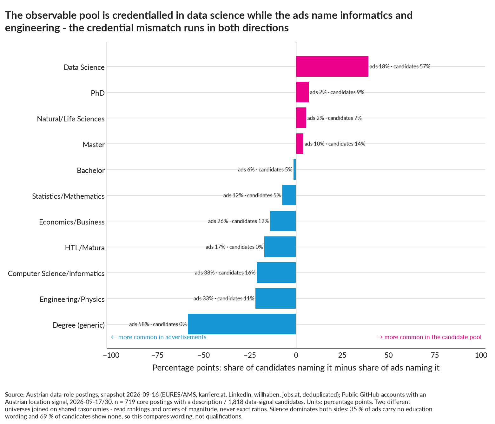](../outputs/figures/BQ38_education_both_sides.png)

*Relationship:* deviation from target · *mark:* `diverging_bar` (categorical-value) · *units:* percentage points

*Built from:* `DS08_demand_supply_education.csv`

*Read with:* Absence of education wording is not absence of a degree on either side; 69 % of candidates write nothing about education at all, so these shares are lower bounds of very different kinds.

*Attached in:* `CAREER_SUPPLY_DEMAND_MAP.md`, `docs/supply-findings.md`

## BQ39_title_fragmentation

**Q. How fragmented is the candidate market - does a title even mean anything here?**

Self-description is fragmented (574 distinct raw bio titles) but the underlying positioning is not: it collapses into 13 normalised titles, and 'Data Scientist' alone holds 56% of bio-declared accounts - so a differentiated title is cheap to claim and crowded to hold, which is why the evidence behind it matters more than the label.

[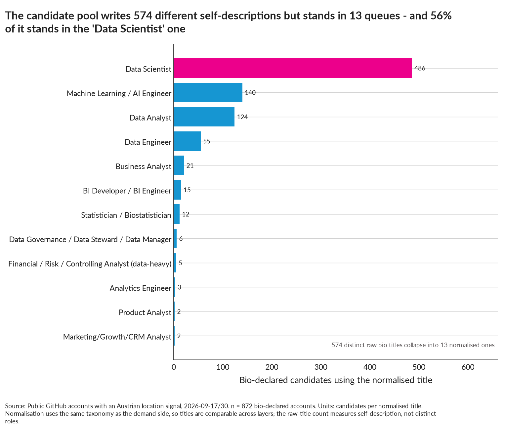](../outputs/figures/BQ39_title_fragmentation.png)

*Relationship:* ranking · *mark:* `horizontal_bar` (bivariate-simple) · *units:* candidates

*Built from:* `C04b_title_concentration.csv`, `C03_normalized_title_distribution.csv`

*Read with:* Titles come from GitHub bios, which are written for a developer audience rather than a recruiter; this is self-presentation, not employment.

*Attached in:* `docs/supply-findings.md`, `CAREER_SUPPLY_DEMAND_MAP.md`

## BQ40_project_counts

**Q. How many projects does a candidate actually show - what would put me above the pool?**

Not many: 17% of observed candidates show no project at all, 63% hold three or fewer, and the median is two - so two or three finished, documented projects is not a modest portfolio in this pool, it is an above-median one, and the differentiator is documentation rather than count.

[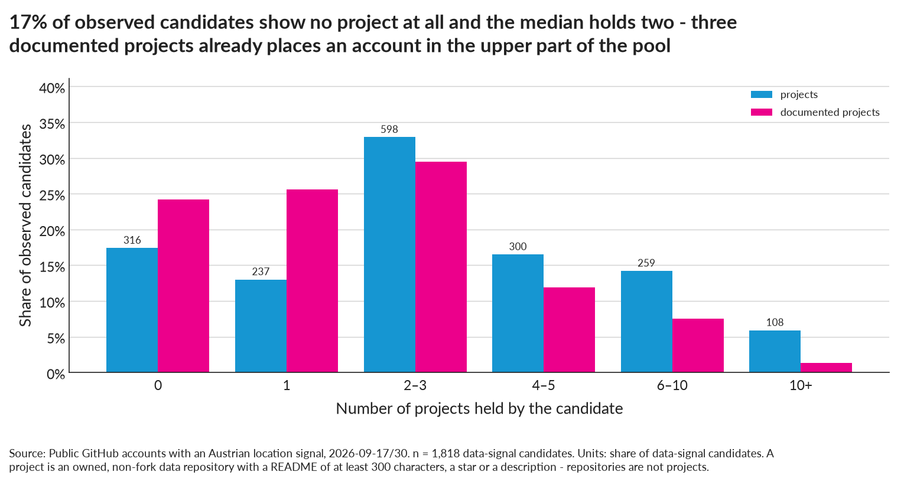](../outputs/figures/BQ40_project_counts.png)

*Relationship:* comparison across categories · *mark:* `grouped_bar` (bivariate-dual) · *units:* share of candidates

*Built from:* `C16_project_count_distribution.csv`

*Read with:* Counts only public, non-fork repositories: private, client and employer work is invisible, so this is a floor on what candidates have built, not a measure of their experience.

*Attached in:* `CAREER_SUPPLY_DEMAND_MAP.md`, `docs/supply-findings.md`

## BQ41_project_topics

**Q. What is the pool actually building - and is it what Austrian employers pay for?**

Methods rather than businesses: NLP, classification, LLM apps and computer vision lead, with the listed method and AI themes covering 65% of projects against 18% for business domains - while the ads are dominated by finance/controlling, operations and marketing context, so a domain-framed project is scarce exactly where demand is thick.

[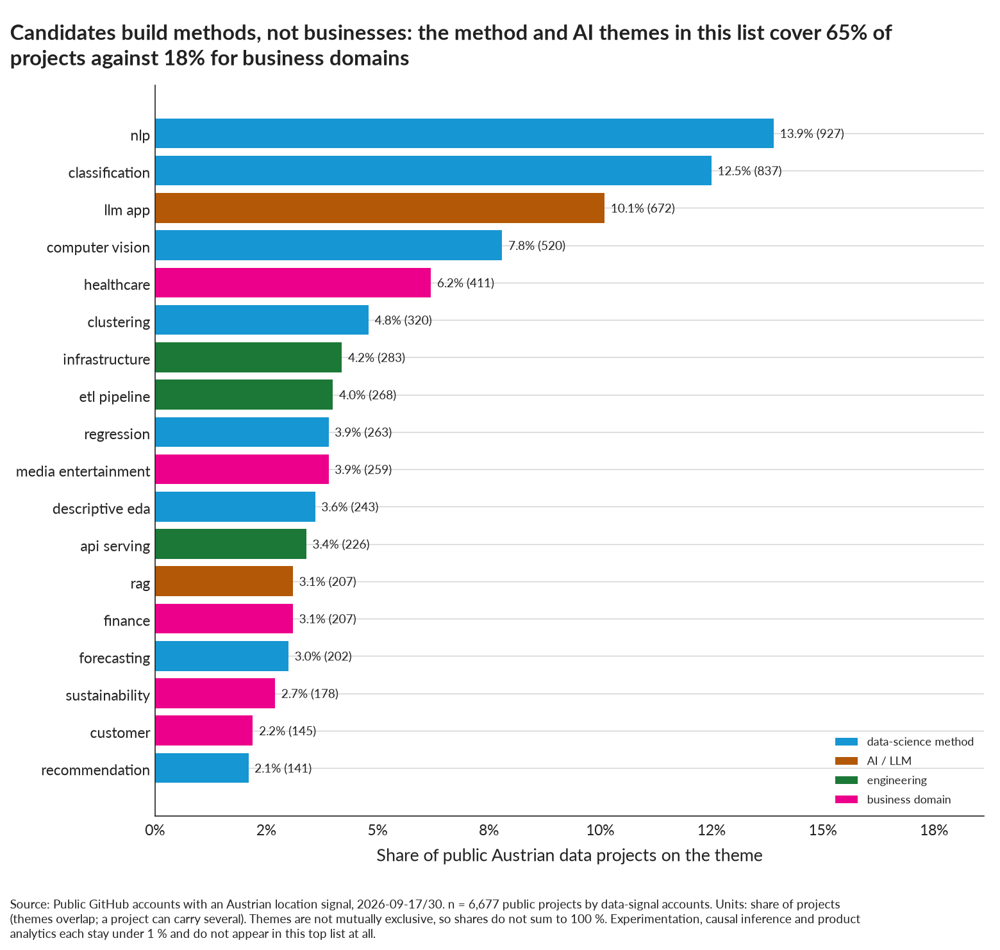](../outputs/figures/BQ41_project_topics.png)

*Relationship:* ranking · *mark:* `horizontal_bar` (bivariate-simple) · *units:* share of projects

*Built from:* `C18_project_topics.csv`, `C18c_project_theme_coverage.csv`

*Read with:* Themes are rule-based over repository names, descriptions, topics and READMEs and can overlap; a project with no README text is under-classified rather than absent.

*Attached in:* `CAREER_SUPPLY_DEMAND_MAP.md`, `docs/supply-findings.md`

## BQ42_repository_archetypes

**Q. When I look at a competitor's GitHub, what am I usually looking at?**

Mostly abandoned or educational material: 28% of public Austrian data repositories are inactive archives and 21% are course or tutorial work, while analytics projects are 2.7% and data-engineering projects under 2 % - the bar for a maintained, business-shaped repository is far lower than the raw repository counts suggest.

[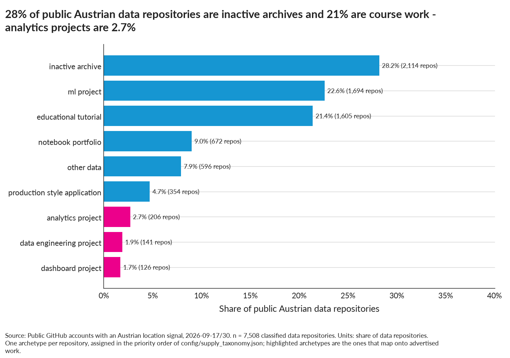](../outputs/figures/BQ42_repository_archetypes.png)

*Relationship:* ranking · *mark:* `horizontal_bar` (bivariate-simple) · *units:* share of repositories

*Built from:* `C14c_repository_archetypes.csv`, `C14d_data_repo_activity.csv`

*Read with:* Archetypes are rule-based and mutually exclusive by priority order; 'inactive' measures the last push date, which says nothing about whether the work was good when it was made.

*Attached in:* `docs/supply-findings.md`

## BQ43_positioning_clusters

**Q. Which positioning spaces actually exist in the pool, and which of them is least crowded?**

Eight descriptive clusters, of which the largest holds 457 of 1,818 candidates with a median of 0 projects; the notebook-ML and deep-learning clusters are the dense ones, while clusters defined by pipelines, dashboards or business domains are both smaller and better evidenced - the space is chosen by what the projects show, not by the title claimed.

[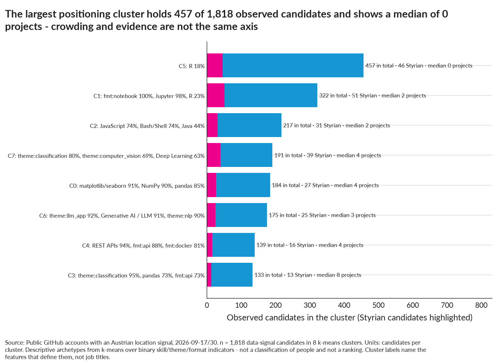](../outputs/figures/BQ43_positioning_clusters.png)

*Relationship:* ranking · *mark:* `horizontal_bar` (bivariate-simple) · *units:* candidates

*Built from:* `C23_positioning_clusters.csv`, `DS11_demand_supply_positioning_clusters.csv`

*Read with:* k-means on binary indicators with weak separation: these are readable groupings, not natural kinds, and a candidate near a boundary could sit in either cluster.

*Attached in:* `CAREER_SUPPLY_DEMAND_MAP.md`

## BQ44_transition_domains

**Q. How common is a career transition into data - and does anyone arrive from marketing?**

Rare in public evidence and almost absent from marketing: 12.2% of bio-declared accounts name a business background, while marketing is named by 10 of 872 - but GitHub does not narrate careers (3.4 % state a transition at all), so this is evidence of silence, not evidence of absence, and the transition story is one the CV and LinkedIn must carry because the code cannot.

[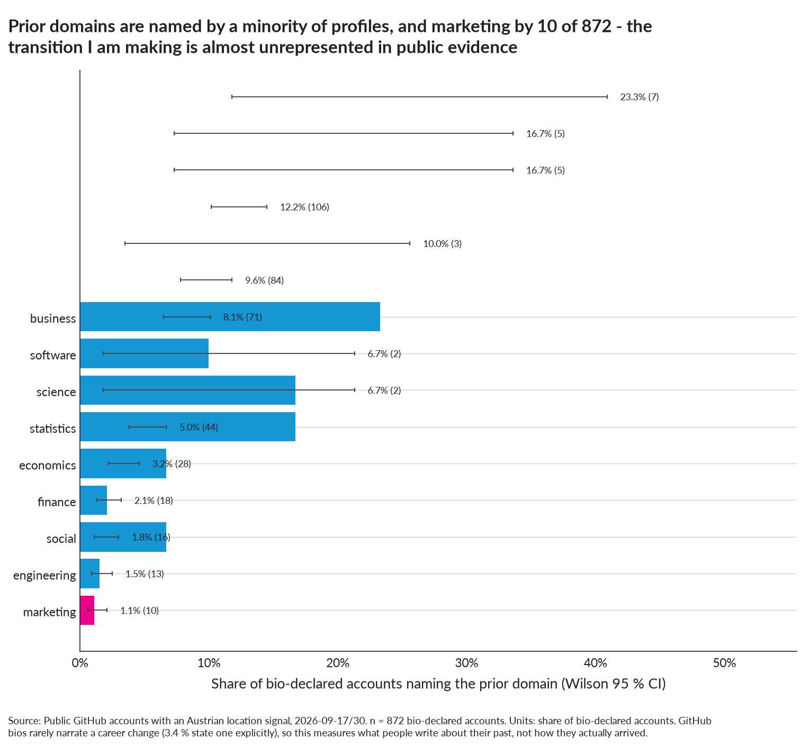](../outputs/figures/BQ44_transition_domains.png)

*Relationship:* ranking · *mark:* `horizontal_bar` (bivariate-simple) · *units:* share of accounts

*Built from:* `C22b_prior_domains.csv`, `C22_transition_signals.csv`, `C22d_marketing_named_bios.csv`

*Read with:* Prior domain is detected from bio wording only. Transitioners who do not write about their past are invisible here, which is the most likely explanation for the low counts.

*Attached in:* `CAREER_SUPPLY_DEMAND_MAP.md`, `docs/supply-findings.md`

## BQ45_skill_premium_controlled

**Q. Do the better-paying skills actually pay better, or am I just looking at which family names them?**

Mostly the latter: after controlling for role family, seniority and state, 14 of 16 skills have intervals straddling zero - Python's raw +8 % becomes -7 % - and only Databricks (+13 %) and Excel (-9 %) still separate from zero. After a Holm correction over all 16 skills Databricks and Excel still clear zero; Benjamini-Hochberg keeps 2 of 2. The floor is set by the family and the seniority label, not by the tool named in the advertisement.

[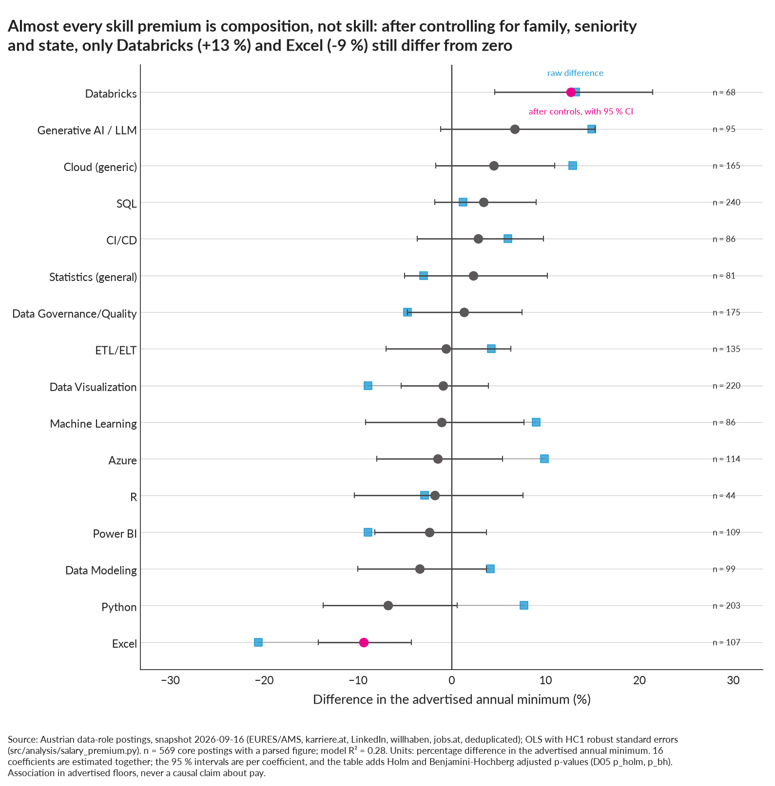](../outputs/figures/BQ45_skill_premium_controlled.png)

*Relationship:* uncertainty · *mark:* `error_bars` (interval-range) · *units:* percent

*Built from:* `D05_skill_salary_premium.csv`

*Read with:* Advertised minimums, not pay. Employer size, industry and hours basis are not controlled, the intervals shown are uncorrected (the adjusted p-values are in D05), and R² is low - this bounds how much of the raw gap is composition, it does not price a skill.

*Attached in:* `docs/market-guide.md`, `CAREER_DECISION_MAP.md`, `docs/salary-context.md`

